<div align="center">

# html-explainer

**Turn a topic into a narrated, subtitled, fully-covered explainer video — locally, from HTML, with audio-video sync that actually holds.**

A deterministic HTML → MP4 pipeline for AI coding agents.
No Remotion. No cloud render queue. No per-render fees. No API keys for the core path.

[](LICENSE)
[](CHANGELOG.md)
[](https://python.org)
[](https://nodejs.org)
[](#requirements)
[](CONTRIBUTING.md)

[简体中文](README.md) · [English](README.en.md)

</div>

---

## What it is

`html-explainer` produces explainer and knowledge videos — the kind with a voiceover, hard
subtitles, a progress bar, and motion-graphics scenes built in HTML/CSS/GSAP.

You write a narration script. An agent (or you) picks a visual style from a library of 23,
writes one self-contained HTML file per beat, and this pipeline renders it to a real MP4
with frame-accurate subtitle timing and two platform-ready covers.

Everything runs on your machine. The only network calls are the TTS request and, optionally,
web research for the script.

It is packaged as an **Agent Skill** (`SKILL.md` + `scripts/` + `references/`), so it drops
into Claude Code, WorkBuddy, Cursor, or any agent that can read a skill file — but the
scripts themselves are plain Python and Node, and run perfectly well by hand.

---

## The core idea: deterministic seeking instead of screen recording

Most "HTML to video" tools launch a browser, play the animation, and screen-record the
result. That approach is the source of an entire family of bugs that are maddening because
they are *intermittent*: the animation starts before recording does, a web font resolves late
so half the video uses the wrong typeface, the first few frames capture a pre-animation
state.

`html-explainer` does not record. It **seeks**.

For every single frame it:

1. sets `window.__MG_RENDER__` so the frame knows not to autoplay,
2. seeks the GSAP timeline to that exact timestamp with `tl.pause(t, false)`,
3. synchronises every CSS animation with `document.getAnimations().currentTime = t * 1000`,
4. waits two animation frames, then screenshots.

Frame 1,204 of a render is bit-identical to frame 1,204 of the next render. That property is
what makes the rest of the system possible — QC can audit specific frames, a single scene can
be re-rendered in isolation, and a whole class of timing bugs simply cannot occur.

> The second parameter is not optional. `pause(atTime, suppressEvents)` defaults
> `suppressEvents` to `true`, which silently drops every callback fired by the seek — a
> counter animated via `onUpdate` will sit frozen at its initial value with no error. This
> cost real debugging time; see [`references/lessons.md`](references/lessons.md) #27.

---

## Features

| | |
|---|---|
| **Narration-locked beats** | Scenes position their animation by *matching subtitle text* (`B('block text')`), never by hardcoded frame number. Rewrite the script and the whole video re-times itself — **not one line of frame code changes.** |
| **Word-boundary subtitles** | Timing comes from edge-tts `WordBoundary` events, not character-count interpolation. In Chinese, two same-length phrases can differ 3× in duration, so interpolation drifts badly. |
| **Two-level clock** | Frame length uses the MP3 *container* duration (keeps audio and video aligned); the final subtitle block retires on the true *speech* end. Mixing the two produces subtitles that linger ~0.8s per scene. |
| **23 visual styles** | Eight categories — bold signal cards, luxury minimal, NYT-grade data charts, Swiss grid, glitch art, film light-leak, fluid hero, brand outro, and more. Each with canvas, type scale, timeline, and colour discipline documented. |
| **Dual covers** | Every finished video also ships a 16:9 feed cover and an independently laid-out 3:4 grid cover. Not a crop — a crop loses 57.8% of the frame width. |
| **Pre-render linting** | `lint_frames.py` audits all eight frame-contract rules before you spend 15 minutes rendering. |
| **Adaptive QC** | Loudness, duration drift, stream integrity, and a sampled contact sheet — with frame-size thresholds derived from the video's own median, so dark themes don't produce false positives. |
| **Offline by construction** | GSAP is vendored. Chrome or Edge is auto-detected. ffmpeg falls back to the static binary that ships with `imageio-ffmpeg`. Web fonts are banned by contract. |
| **Single source of truth for colour** | Every colour lives in `theme.css` as a CSS variable. Change the theme and the entire video re-skins with zero frame edits. |

---

## How it compares

| | `html-explainer` | Screen-recording HTML tools | Remotion | Cloud video APIs |
|---|---|---|---|---|
| **Render method** | Deterministic seek | Live capture | React → frames | Server-side render |
| **Reproducible frames** | Yes | No | Yes | N/A |
| **Per-render cost** | Zero | Zero | Zero | Metered |
| **Runtime dependency** | Node + Python + a browser | Same | Node + React toolchain | Network + account |
| **Authoring model** | HTML/CSS/GSAP per scene | HTML per scene | React components | JSON / template |
| **Re-timing after a script edit** | Automatic (`B()` beats) | Manual | Manual | Manual |
| **Works offline end-to-end** | Yes | Yes | Yes | No |
| **Built-in style library** | 23 documented styles | Varies | Community templates | Vendor templates |
| **Cover/thumbnail output** | Two verified layouts | No | No | Sometimes |

The honest trade-off: because rendering is seek-based, **every animation must be seekable**.
Wall-clock animation (`setInterval`, `requestAnimationFrame` counters, CSS `transition`
entrances) cannot work and is rejected by the linter. That constraint is what buys
determinism, and it is enforced rather than merely advised.

---

## Pipeline

```mermaid
flowchart LR
    A["Topic"] --> B["Research<br/><i>facts with sources</i>"]
    B --> C["narration.json<br/><i>text, | splits subtitle blocks</i>"]
    C --> D["tts_build.py<br/><i>edge-tts → MP3 + word boundaries</i>"]
    D --> E["timeline_build.py<br/><i>global axis + stitched track</i>"]
    E --> F["subs.py<br/><i>subs.json · srt/vtt · beats.js</i>"]
    F --> G["frames/*.html<br/><i>one scene per beat, style from library</i>"]
    G --> H{"lint_frames.py<br/>8 contract rules"}
    H -->|fail| G
    H -->|pass| I["render_video.mjs<br/><i>seek → PNG per frame</i>"]
    I --> J["ffmpeg<br/><i>H.264 + AAC mux</i>"]
    J --> K[("out/slug.mp4")]
    I --> L["qc_check.py<br/><i>loudness · drift · contact sheet</i>"]
    K --> M["cover_build.mjs<br/><i>cover_169.png · cover_34.png</i>"]

    style K fill:#1f6feb,color:#fff
    style H fill:#8957e5,color:#fff
    style M fill:#238636,color:#fff
```



The order matters. `beats.js` is generated from the TTS output, which is why changing the
script re-times everything downstream without touching scene code.

---

## Requirements

| Requirement | Minimum | Notes |
|---|---|---|
| Python | 3.9+ | `edge-tts==7.2.8` (pinned deliberately — v7 changed the boundary API), `numpy`, `pillow`, `imageio-ffmpeg` |
| Node.js | 18+ | Runs the renderer and cover builder |
| Browser | Chrome or Edge | Auto-detected. Neither present → playwright chromium (~115MB, downloaded once) |
| ffmpeg | any | Found on `PATH`, otherwise the static binary bundled with `imageio-ffmpeg` is used |
| Disk | ~2 GB per finished video | Frame PNGs are large; they can be discarded after muxing |

No administrator rights are needed anywhere. Everything installs to user scope.

---

## Quick start

```bash
git clone https://github.com/OneMoh/html-explainer.git
cd html-explainer

# 1 · Check the environment (reports what's missing)
bash setup_env.sh

# 2 · Install anything missing
bash setup_env.sh --install
```

Then run the pipeline inside a project directory:

```bash
PY=<path to your venv python>     # expand to an absolute path if you hand work to an agent
SKILL=$(pwd)                      # this repo

# Stage 0 — scaffold a project
"$PY" "$SKILL/scripts/new_project.py" ~/videos/ai-intro ai-intro --topic "人工智能"
cd ~/videos/ai-intro

# …write narration.json, fill project.json's order,
#   and author one frames/<id>.html per scene…

# Stages 1–3 — voiceover, timeline, subtitles
"$PY" "$SKILL/scripts/tts_build.py"      --project .
"$PY" "$SKILL/scripts/timeline_build.py" --project .
"$PY" "$SKILL/scripts/subs.py"           --project .

# Stage 4 — audit frames before spending render time
"$PY" "$SKILL/scripts/lint_frames.py"    --project .

# Stage 5 — render (--preview N gives a fast draft of the first N seconds)
node "$SKILL/scripts/render_video.mjs" . --preview 30

# Stage 6 — QC
"$PY" "$SKILL/scripts/qc_check.py"       --project .

# Stage 7 — full render + covers
node "$SKILL/scripts/render_video.mjs" .
node "$SKILL/scripts/cover_build.mjs"  .
```

Output lands in `out/`: `slug.mp4`, `cover_169.png`, `cover_34.png`, `slug.srt`, `slug.vtt`,
plus `qc_report.md` and `qc_sheet.jpg`.

> **Always pass `--keep-frames` if you intend to reuse the rendered PNGs.** Preview mode
> deletes the frame directory after muxing, by design. See
> [`references/lessons.md`](references/lessons.md) #32.

---

## Command reference

### Pipeline

| Command | Does |
|---|---|
| `python scripts/new_project.py <dir> <slug> [--topic T] [--preset P] [--fps 30] [--width 1920] [--height 1080] [--lang zh]` | Scaffolds a project: config, theme, templates, and both cover HTML files |
| `python scripts/tts_build.py --project . [--voice V] [--rate +8%] [--no-trim] [--no-cache]` | Synthesises narration; caches, timeouts, retries, trims silence; writes both duration clocks |
| `python scripts/timeline_build.py --project . [--gap SEC]` | Builds the global timeline and stitches `narration-full.mp3` |
| `python scripts/subs.py --project . [--fps N]` | Emits `subs.json`, `srt`/`vtt` sidecars, and one `beats.js` per scene |
| `python scripts/lint_frames.py --project . [--only id,id] [--include-covers]` | Static audit of every frame against the eight contract rules |
| `node scripts/render_video.mjs <dir> [--out PATH] [--preview SEC] [--fps N] [--concurrency N] [--jpeg] [--scale N] [--keep-frames] [--browser PATH]` | Renders and muxes to MP4 |
| `python scripts/qc_check.py --project . [--samples N]` | Loudness / duration / stream audit plus a contact sheet |
| `node scripts/cover_build.mjs <dir> [--at last\|SEC] [--only 169\|34] [--scale N] [--jpg] [--keep-frames]` | Renders both covers at 2× by default |

### Utilities

| Command | Does |
|---|---|
| `node scripts/peek_frame.mjs <dir> <id> [--at 40,80]` | Screenshots one scene at percentage points — seconds, not minutes. `--all` for every scene |
| `python scripts/make_theme.py --topic "医疗" --use` | Derives a palette from a topic word, or `--preset violet\|cyan\|amber\|mono` |
| `python scripts/check_integrity.py` | Version / catalog / count consistency and stray-CDN scan (also runs in CI) |
| `python setup_env.sh --install` → `bash setup_env.sh --install` | Environment check and dependency install |
| `python scripts/package_skill.py [--with-deps]` | Builds a portable zip (omit `--with-deps` for ~110KB) |

---

## The `B()` beat system

This is the part that changes how the work feels.

A generated `beats.js` per scene exposes every subtitle block by its text:

```js
B('右边卡片')      // the second the phrase "右边卡片" starts being spoken
Be('证据')         // the second that phrase finishes
```

So scene animation reads like this:

```js
var tl = gsap.timeline({ paused: true });
window.__tl = tl;

tl.fromTo('.card',   { y: 60, autoAlpha: 0 }, { y: 0, autoAlpha: 1, duration: 0.7 }, B('右边卡片'));
tl.fromTo('.verdict',{ scale: 0.8 },          { scale: 1, duration: 0.6, ease: 'back.out(2)' }, B('结论句') + 0.2);
```

Reword the narration and you re-run three commands. The beats shift, every scene re-times
itself, and no frame file is edited. Compare that with frame-number hardcoding, where one
changed sentence means re-aligning the entire video by hand.

**The fallback form is banned.** `B('x') || 3.2` hides a broken beat lookup behind a stale
number. If a block can't be found the build should fail loudly — a mis-timed video is worse
than a failed build.

---

## Visual style library

**Do not design scenes from a blank page.** 23 styles across 8 categories, each documented
with its canvas, type scale, timeline structure, and colour discipline
([`references/style-catalog.md`](references/style-catalog.md)).

| Category | Styles |
|---|---|
| Presentation / title cards | Bold Poster, Bold Signal, Build Minimal, Creative Voltage, Electric Studio, Glitch Title, Kinetic Type, Swiss Grid, Warm Grain |
| Data visualisation | NYT Data Chart, Data Rollup, NYT Graph, Swiss Grid Data |
| Diagrams / process | Takram Organic, Decision Tree |
| Cinematic atmosphere | Film Light-Leak |
| Marketing / hero | Fluid Background Hero |
| Bumpers | Brand Logo Outro |
| Social portrait (9:16) | Play Mode, Vignelli |
| Product demo | Product Promo, Product Promo · 30s |
| Effects | VFX Text Cursor |

Two classes, two very different adaptation costs:

- **`rich` (12)** — a single file driven by pure CSS `@keyframes`. The seek renderer drives
  these **with zero code changes**; adapting one is three steps: swap the web font for a
  system stack, lift bottom elements out of the subtitle zone, fill in real content.
- **`gsap` (11)** — multi-composition, CDN-loaded. **Do not port the code.** A multi-scene
  composition has no playback hook inside a single seekable frame, so importing it yields a
  static first frame and no error whatsoever. Take the visual DNA and re-express it as CSS
  keyframes.

Rotate two to four styles across a video. Eight scenes sharing one template looks stale;
mixing an aggressive opener, a spare mid-section, and a data-driven conclusion does not.

---

## Dual-cover system

A finished video produces **two covers that are siblings, not a crop pair**.

Cropping 3:4 out of 16:9 yields 810px from 1920px — discarding **57.8% of the frame width**.
Any full-width headline gets sliced. So both covers share one visual DNA (palette,
backdrop, key visual, hook copy) but are each laid out from scratch:

| Element | 16:9 (`1920×1080`) | 3:4 (`1440×1080`) |
|---|---|---|
| Paradox visual | Right side, side-by-side | Top, vertically stacked |
| Hook | Bottom-left, 2 lines, ≥96px | Bottom, 3 lines, ≥120px |
| Corner label | Top-left | Top-centre or dropped |
| Max characters per line | 7 | 5 |

Three elements are mandatory, and a missing one means rework: a large hook with genuine
tension, a central visual that *argues a contradiction* (two figures moving opposite ways,
a split line, light against dark — not a decorative shape), and margin to spare
(≥96px / ≥110px on all sides).

Output is 2× by default: `3840×2160` and `2880×2160`, sized for platform compression.

Full rules and the pre-upload checklist: [`references/cover-guide.md`](references/cover-guide.md).

---

## The frame contract

One scene is one self-contained HTML file. Eight rules — enforced by `lint_frames.py`, and
each one exists because breaking it fails *quietly*:

| # | Rule | Breaks like this |
|---|---|---|
| 1 | Canvas `1920×1080` (or the size declared in `project.json`), system fonts only | Render viewport is the canvas |
| 2 | **No external fonts or CDNs** | Font fetch times out; type weight shifts mid-video |
| 3 | Colours only from `../theme.css` variables | A theme change becomes a partial re-skin |
| 4 | GSAP timeline registered on `window.__tl` | Renderer finds no timeline and errors |
| 5 | Position animation with `B('block text')` | Frame and voiceover drift apart |
| 6 | Keep the bottom 80–170px clear (subtitle zone) | Subtitles overprint content; both become unreadable |
| 7 | One focal point per frame; text ≥22px | QC rejection |
| 8 | Load GSAP from `../assets/gsap.min.js` | CDN unreachable → offline render fails |

Numbers animated in a frame should use a **pure-transform digit strip** rather than
`onUpdate`. The renderer passes `suppressEvents = false` so callbacks do work, but a
transform-based animation depends on no callback at all and therefore survives every seek
strategy.

Details, layout vocabulary, and the rejection examples: [`references/frame-contract.md`](references/frame-contract.md).

---

## Project layout

```
html-explainer/
├── SKILL.md                      # Agent-facing entry point: workflow, commands, contracts
├── README.md                     # Project documentation (Chinese, default)
├── README.en.md                  # This document
├── LICENSE · THIRD_PARTY_NOTICES.md · licenses/
├── CHANGELOG.md · CONTRIBUTING.md
│
├── scripts/
│   ├── new_project.py            # Scaffold
│   ├── tts_build.py              # edge-tts → MP3 + word boundaries
│   ├── timeline_build.py         # Global axis + stitched audio
│   ├── subs.py                   # Subtitles ×3 outputs + beats.js
│   ├── lint_frames.py            # Pre-render contract audit
│   ├── render_video.mjs          # Deterministic seek renderer
│   ├── qc_check.py               # Post-render audit + contact sheet
│   ├── cover_build.mjs           # Dual-cover renderer
│   ├── peek_frame.mjs            # Single-scene screenshot preview
│   ├── make_theme.py             # Palette derivation → theme.css
│   ├── check_integrity.py        # Repo self-consistency (CI)
│   ├── import_styles.py          # One-time style-catalog import tool
│   └── package_skill.py          # Portable zip builder
│
├── references/
│   ├── style-catalog.md / .json  # 23 styles, 8 categories
│   ├── template-guide.md         # Adaptation recipes
│   ├── frame-contract.md         # The eight rules, with reasoning
│   ├── cover-guide.md            # Dual-cover specification
│   ├── workflow-guide.md         # Stage-by-stage detail + agent prompt templates
│   └── lessons.md                # 34 numbered silent-failure post-mortems
│
├── assets/
│   ├── frame-template.html       # Scene template
│   ├── cover-template.html       # Cover template
│   └── gsap.min.js               # GSAP 3.13, bundled for offline rendering
│
├── node/                         # Vendored playwright-core
├── setup_env.sh                  # Environment check / install
└── .github/workflows/ci.yml      # CI: integrity, syntax, CDN scan
```

A **video project** looks like this:

```
my-video/
├── project.json      # slug, fps, size, voice, rate, scene order, chapters
├── narration.json    # [{ id, text }] — "|" splits subtitle blocks
├── theme.css         # Every colour, as CSS variables
├── frames/
│   ├── _template.html
│   ├── <id>.html     # One scene per file
│   ├── <id>.beats.js # Generated — never edit by hand
│   ├── cover_169.html
│   └── cover_34.html
├── audio/  render/  research/  script/
└── out/              # MP4, covers, SRT/VTT, QC report
```

---

## Configuration

`project.json`:

| Key | Meaning |
|---|---|
| `slug` | Output filename stem |
| `lang` | `zh` or `en` — selects the default voice |
| `fps` | Frame rate (default 30) |
| `width` / `height` | Canvas size (default `1920×1080`) |
| `gap` | Silence inserted between scenes, in seconds |
| `order` | Scene IDs in playback order — **fill this in after writing `narration.json`** |
| `chapters` | Optional `[{ title, startSegment }]` for progress-bar ticks |
| `theme` | Theme preset name |
| `voice` | edge-tts voice, e.g. `zh-CN-YunxiNeural` |
| `rate` | Speech rate, e.g. `+8%` |
| `progress` | Whether to render the global progress bar |

Writing narration:

```json
[
  { "id": "hook",   "text": "开场钩子，一到两句。|用竖线切字幕块，每块不超过16个字。" },
  { "id": "point1", "text": "一个场景一句解说。|字幕块之间用竖线分隔。" }
]
```

- `id` becomes the scene name and must be ASCII (`hook`, `point1`, `ending`).
- `|` splits subtitle blocks, **not** scenes. One narration entry = one scene.
- Keep Chinese subtitle blocks ≤16 characters, and split at semantic boundaries.
- Never add punctuation back to control line breaks — the renderer treats subtitles as
  on-screen text and strips punctuation.
- Two adjacent numbers need a Chinese comma between them, or edge-tts reads them as one
  fused number (`沪深300` + `4479.55` → "three million four hundred seventy-nine…").

Aim for roughly 5.4–6 Chinese characters per second. If the total lands more than 15% off
your target duration, rewrite sentences — do not distort the speech rate.

---

## Troubleshooting

| Symptom | Cause | Fix |
|---|---|---|
| Every frame is the static first frame; nothing errors | A timeline was never registered on `window.__tl`, or `page.evaluate` was handed a *string* instead of a function literal (Playwright evaluates a string once and returns the function object — the body never runs) | Register the timeline; pass a real function literal. Lessons #17 |
| Numbers render but never move | `onUpdate` callbacks suppressed by a seek | Fixed in the renderer (`pause(t, false)`). Animate with a transform-based digit strip instead. Lessons #27 |
| Video is 1280×720 instead of 1920×1080 | `viewport` passed to `browser.launch()` — it is a *context* option | Pass it to `newPage()`. Lessons #18 |
| Covers come out at 1× though the log says 2× | Same trap with `deviceScaleFactor` | Pass to `newPage()` + `screenshot({ scale: 'device' })`; verify with PIL. Lessons #28 |
| `No such file or directory` on Windows | Non-ASCII path — ffmpeg on Windows reads UTF-8 as ANSI | Keep project, output, and frame paths ASCII. Lessons #11 |
| Node can't find `/tmp/...` | Git Bash's `/tmp` ≠ Node's `/tmp` on Windows | Pass `C:/...` forward-slash absolute paths. Lessons #12 |
| QC reports every frame as suspicious | Fixed frame-size threshold, invalid on dark themes | Now adaptive (35% of the video's own median). Lessons #19 |
| QC says everything passed but late scenes were never checked | Sampling that slices the first N blocks instead of stepping evenly | Fixed. Lessons #29 |
| Subtitles vanish slightly early on the last block | `speech_end_sec` computed in pre-trim coordinates | Fixed in 1.2.2. Lessons #31 |
| First 0.5s of the video is nearly black | Entrances fading in from `opacity: 0` on the first narration beat | Start earlier, use `power4.out`, and let a mask wipe provide the reveal instead of opacity. Lessons #34 |
| Rendered PNGs disappeared after a preview | Preview mode deletes the frame directory by design | Pass `--keep-frames`. Lessons #32 |
| Re-rendered the whole video to fix one scene | No per-scene switch exists | Use the temporary-project technique. Lessons #33 |

**`references/lessons.md` is the most valuable file here.** 34 numbered entries, each
recording a bug that produced a plausible-looking video while being wrong — including how
it was misdiagnosed first. Read it before debugging from scratch.

---

## Who this is for

**Good fit**

- You want to turn articles, documentation, or a topic into narrated videos at some volume.
- You already work with an AI coding agent and would rather express scenes as HTML than
  learn a motion-graphics suite.
- You need reproducible output — re-render the same project and get the same frames.
- You need it to run offline, or you object to per-render pricing.
- You want the infrastructure work done: subtitles, audio sync, covers, QC.

**Poor fit**

- Real-footage editing, talking-head video, or recreating an existing video.
- React component animation as the authoring model (that is the job of the Remotion-based
  `anything2explainer`, this project's sibling).
- A graphical drag-and-drop editor. Scenes are code, deliberately.

---

## Roadmap

- [ ] Per-scene render switch (`--only <id>`) — today this needs the temporary-project workaround
- [ ] Cover layout measurement tool (line count / four-side margins / element overlap / hook size in one pass) — today you write a dozen lines yourself
- [ ] Additional cover aspect ratios via the spec table in `cover_build.mjs`
- [ ] English-first style notes in the catalog (currently Chinese descriptions throughout)
- [ ] Optional background-music bed with automatic ducking under narration
- [ ] Frame-contract lint rules for focal-point and glow discipline (currently eyeball-only)
- [ ] Pre-built project templates for common video shapes (60s short, 3-min explainer)

---

## Contributing

Issues and PRs are welcome. The most valuable contribution is a **diagnosed silent
failure** added to `references/lessons.md` — the symptom as it first misled you, the
evidence that proved the cause, the fix, and the resulting rule.

Please read [`CONTRIBUTING.md`](CONTRIBUTING.md) first. It covers the project's hard rules,
how to run an end-to-end check, and the PR checklist.

CI checks the repository for version drift, style-catalog drift, and stray CDN references
on Linux and Windows across Python 3.9 and 3.13.

---

## Acknowledgements

The narration and audio-sync methodology in this project — word-boundary subtitles, the
two-level clock, speech-rate calibration, and the QC criteria — grew out of two earlier
projects by the same author, `anything2explainer` and `html-video-workbuddy-driver`.

The 23-style visual catalog transcribes the template design specifications of
[nexu-io/html-video](https://github.com/nexu-io/html-video) (Apache-2.0). Seven of those
styles in turn trace back to MIT-licensed design work by
[Zara Zhang](https://github.com/zarazhangrui/frontend-slides),
[alchaincyf](https://github.com/alchaincyf/huashu-design), and Nate Herk.

No upstream source code is bundled or required at runtime — the catalog is a written
specification, comparable to copying a recipe out of a restaurant. Full attribution, licence
texts, and the exact style-level mapping are in
[`THIRD_PARTY_NOTICES.md`](THIRD_PARTY_NOTICES.md).

GSAP is bundled under GreenSock's [standard "no charge" licence](https://gsap.com/standard-license).

---

## Licence

[MIT](LICENSE) © 2026 Moh

The MIT licence covers the original code and documentation. Third-party components and the
derived style specification remain under their own terms — see
[`THIRD_PARTY_NOTICES.md`](THIRD_PARTY_NOTICES.md).

---

<div align="center">

**Author: Moh**

Built because re-aligning an entire video by hand after one changed sentence is a bad way to spend an afternoon.

</div>
