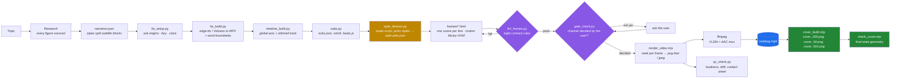

<div align="center">

# html-explainer

**An Agent Skill: give it a topic, get back a narrated explainer video with subtitles and covers.**

Write scenes in HTML → deterministic frame-by-frame rendering → a real MP4. Everything runs
locally; the core pipeline needs no API key and charges no per-render fee.

Scenes are written with a seekable motion library, styles are picked by a theme-driven
orchestrator, and rendering supports 4K60, shutter-based motion blur and multi-process parallelism.

[](LICENSE)
[](CHANGELOG.md)
[](SKILL.md)
[](#install)
[](#install)
[](#install)
[](#requirements)
[](#requirements)

[简体中文](README.md) · [English](README.en.md)

<br/>

Two finished videos made with this skill — visuals, voiceover, subtitles and covers all
produced by the pipeline, no manual post-production. Covers and other assets live in a separate
[demos repository](https://github.com/OneMoh/html-explainer-demos); this repo stays text-only.

| HK innovative drugs · early session | A quant firm built an LLM |
|---|---|
| https://github.com/user-attachments/assets/8007843c-088d-457c-8550-81ec912e0add | https://github.com/user-attachments/assets/28949988-449b-4c4e-8d0f-6706af6f64ee |

</div>

---

## What it is

`html-explainer` turns a topic into a **narrated explainer video with burned-in subtitles and a
progress bar**, with the visuals written in HTML/CSS/GSAP.

**It is an Agent Skill** (`SKILL.md` + `scripts/` + `references/`), following the
[Agent Skills](https://code.claude.com/docs/en/skills) convention, so Claude Code, OpenAI Codex,
WorkBuddy, Cursor, Gemini CLI and others can load it directly. Underneath it is plain Python and
Node scripts, so you can also run it by hand.

You say one sentence:

> Make a 1-minute explainer video about why the sky is blue.

The skill then walks the agent through: research → script → voiceover → subtitles and beats →
**style orchestration and scene authoring** → render → QC → covers.

Scenes do not start from a blank page. The skill ships a **seekable motion library** (40+ action
words — see [Motion library and style orchestration](#motion-library-and-style-orchestration)) and
a **style orchestrator** that reads the narration itself, works out what role each scene plays, then
picks styles, mixes them, and decides openers and transitions; the renderer supports 4K60,
shutter-based motion blur and multi-process parallelism. Every switch is optional: run it with no
flags and you get the plainest 1080p30 video.

---

## Install

### One-line install (recommended)

Send this to your agent:

```text
Install this Skill into my local environment: https://github.com/OneMoh/html-explainer.git
Put it in your skills directory and check/install the required runtime
(Python 3.9+ / Node 18+ / Chrome or Edge / ffmpeg)
```

It clones into the right directory, runs the environment check and installs whatever is missing.
Then **start a new session** so the agent rescans its skills directory.

### Manual install

The repository root **is** the skill directory (`SKILL.md` sits at the root), so clone it straight
into your skills directory — there is no subdirectory to copy:

```bash
git clone https://github.com/OneMoh/html-explainer.git ~/.workbuddy/skills/html-explainer
bash ~/.workbuddy/skills/html-explainer/setup_env.sh --install
```

On Windows `~` is `C:\Users\<you>`.

### Skills directory by agent

| Agent | Personal (global) | Project (in-repo) |
|---|---|---|
| **WorkBuddy** | `~/.workbuddy/skills/` | `<workspace>/.workbuddy/skills/` |
| **Claude Code** | `~/.claude/skills/` | `.claude/skills/` |
| **OpenAI Codex** | `~/.codex/skills/` | `.codex/skills/` or `.agents/skills/` |
| **Gemini CLI** | `~/.gemini/skills/` | `.gemini/skills/` or `.agents/skills/` |
| **Cursor** | `~/.cursor/skills/` | `.cursor/skills/` |
| **GitHub Copilot / VS Code** | `~/.copilot/skills/` | `.github/skills/` |
| **OpenCode** | `~/.config/opencode/skills/` | `.opencode/skills/` |
| **Windsurf** | `~/.windsurf/skills/` | `.windsurf/skills/` |
| Others (common convention) | `~/.agents/skills/` | `.agents/skills/` |

If unsure where to put it, prefer `.agents/skills/` — most tools read it. (Claude Code is the
exception and only reads `.claude/skills/`.)

### Requirements

| Item | Minimum | Notes |
|---|---|---|
| Python | 3.9+ | `edge-tts==7.2.8` (pinned deliberately — v7 changed the boundary API), `numpy`, `pillow`, `imageio-ffmpeg`. **The Volcano engine needs nothing extra** (stdlib `urllib` only, no SDK) |
| Node.js | 18+ | Used by the renderer and the cover builder |
| Browser | Chrome or Edge | Auto-detected; playwright chromium (~115MB, one time) only if neither exists |
| ffmpeg | any version | Looked up on `PATH`; falls back to the static binary bundled with `imageio-ffmpeg` |
| Disk | ~2GB per video | Frame PNGs are large; safe to delete after muxing |

`bash setup_env.sh` only reports what is missing; `--install` installs it. No admin rights needed.
The motion library, the orchestrator and every render profile use only the libraries declared above —
**no new runtime dependencies are introduced**.

---

## Voice-over: two engines

Before the pipeline starts the agent **asks which TTS you want**, then lists candidate voices for
you to pick from (or you can just hand it a voice ID):

| | `edge-tts` | Volcano Engine TTS 2.0 |
|---|---|---|
| What you do | nothing | paste an API Key once |
| Cost | free | billed per character |
| Voices | a set of built-in zh/en voices | Doubao 2.0 voice library, incl. voice cloning |
| Word timestamps | `WordBoundary` | `sentence.words[]` |
| Extra deps | `edge-tts==7.2.8`, `imageio-ffmpeg` | **none** — stdlib `urllib` only |
| When to pick it | default; works out of the box | when you want more natural prosody / better quality |

Both engines emit an **identical** `audio-manifest.json`, so the timeline, the subtitles and the
renderer **all stay untouched** — switching engines is a one-field change.

### With Volcano, the only thing you touch

The first time it runs Volcano, the skill **creates a `tts.env` and stops**, then tells you to paste
your API Key into it (console → Speech → API Key management). Say "done" and the agent tests the
connection, confirms the voice, and carries on.

**That step deliberately bypasses the chat window** — the key is never sent to the agent, and the
agent never needs to know it.

Built-in voices (full list in the
[official voice docs](https://docs.volcengine.com/docs/6561/1257544)):

| Male | Female |
|---|---|
| Yunzhou 2.0 (default) · Wennuan Ahu 2.0 · Jieshuo Xiaoming 2.0 · Cixing Jieshuo Nan 2.0<br>Xuanyi Jieshuo 2.0 · Guanggao Jieshuo 2.0 · Ruya Qingnian 2.0 · Shaonian Zixin 2.0 · Shenye Boke 2.0 | Xiaohe 2.0 · Vivi 2.0 · Zhixing Cancan 2.0<br>Tianmei Taozi 2.0 · Linjia Nvhai 2.0 · Wenrou Shunv 2.0 |

If the built-in list is not enough, a voice ID from voice cloning works too.

### Key discipline

The API Key lives only in `tts.env`, and **only one interface package inside the skill reads it**.
The agent calls that package, so it neither gets nor needs the key value:

```
you (fill it in once) → tts.env (already gitignored)
                            ↓  only the interface package reads it
                     synthesis call  ← the agent calls this; never sees the key
                            ↓
                     Volcano Engine
```

- **Never in the chat**: ask the agent for key status; what comes back is a masked summary
  (`ef90******86c8`).
- **Never in the repo**: `.gitignore` covers `tts.env` / `*.env` / `*.key` / `*.pem` / `secrets/`;
  the repo self-check has a dedicated **key-defence** rule, itself proven by a negative test —
  a deliberately planted fake key gets caught.
- **Never in logs**: error messages are redacted — only the key value actually used and `AKLT…`
  tokens are scrubbed. Deliberately **not** a broad "any long string is a secret" rule, which would
  also erase the request IDs you need for support.
- **Never in a distribution**: packaging the skill excludes key files.
- **Backstop** (the real security boundary): if it leaks anyway, keep the blast radius small — use
  a **sub-account with speech-synthesis-only permission**, set **usage alerts and quotas**, and
  **rotate** the key.

> Bluntly: the synthesis code runs on your machine, so the key is visible to that process at
> runtime — **"the agent can never read it" is not achievable**. What is guaranteed is *not in the
> chat, not in the repo, not in the logs, not in the distribution*, which shrinks a leak into one
> revocable incident.
>
> Also **don't store the key in an environment variable** — many hosts dump the process environment
> straight into the session transcript.

**Don't rename `tts.env.example` to `tts.env` and fill that in.** It is the template meant to stay
in the repo; renaming it leaves everyone else without one (the repo self-check reports it).
Copy it, then fill the copy.

---

## Video project layout

Say one sentence and the agent walks the whole pipeline inside a **video project directory**;
output lands in `out/`: `slug.mp4`, `cover_169.png`, `cover_34.png`, `slug.srt`, `slug.vtt`, plus
`qc_report.md` and `qc_sheet.jpg`; add `cover_916.png` for vertical placements.

A **video project** looks like this:

```
my-video/
├── project.json      # slug, fps, size, voice, rate, scene order, chapters
├── narration.json    # [{ id, text }] — pipes "|" split subtitle blocks
├── theme.css         # every colour, as CSS variables
├── style-plan.json   # per-scene primary/accent style, role, transition, motion intensity
├── consent.json      # the six confirmation points (incl. render channel), user-decided
├── frames/           # one HTML per scene; <id>.beats.js is generated, never hand-edited
├── audio/  render/  research/  script/
└── out/              # MP4, covers, SRT/VTT, QC report
```

---

## Why not screen recording

Most "HTML to video" tools launch a browser, play the animation and record the screen. That breeds
a whole class of **intermittent** bugs — the animation played before recording started, a web font
loaded late so half the video used the wrong typeface, the first frames captured the pre-animation
state.

`html-explainer` does not record. It **seeks**: position the GSAP timeline at that instant
(`tl.pause(t, false)`), sync every CSS animation (`document.getAnimations().currentTime`), wait
two animation frames, screenshot. Frame 1204 of one render is pixel-identical to frame 1204 of the
next — so QC can point-sample, a single scene can be re-rendered alone, and a whole class of timing
bugs becomes impossible.

The trade-off: **every animation must be seekable.** Wall-clock animation (`setInterval`,
`requestAnimationFrame` counters, CSS `transition` entrances) cannot work and is rejected by
`lint_frames.py`. It is exactly why the motion library is built as "`t` → a set of numbers": a pure
function is seekable by construction.

---

## Features

| | |
|---|---|
| **Beats anchored to narration** | Scenes position animation by **matching subtitle text** (`B('block text')`), never by hardcoded frame numbers. Edit the script and the whole video re-times with zero scene-code changes. |
| **Word-boundary subtitles** | Timing comes from the TTS engine's **character-level timestamps**, never interpolated by character count — in Chinese two phrases of equal length can differ 3× in duration. `WordBoundary` for edge-tts, `sentence.words[]` for Volcano Engine. |
| **Two voiceover engines** | `edge-tts` (free, no key, default) or **Volcano Engine TTS 2.0** (better quality, needs an API key). Both emit an identical manifest, so nothing downstream changes — switch with `--provider`. |
| **The API key never reaches the agent or the repo** | The Volcano key lives only in `tts.env` (gitignored) and **only the interface package reads it** — the agent calls `tts_volcano.py` and never needs the key. Errors are redacted, `check_integrity.py` enforces a secret guard, and packaging excludes key files. |
| **Two-level clock** | Frame length uses MP3 **container duration** (keeps A/V in sync); the final subtitle block ends on **actual speech end**. |
| **23 visual styles** | 8 categories, each with its canvas, type scale, timeline and colour discipline recorded. No designing from a blank page. |
| **Motion library (40+ action words)** | `assets/motion.js` turns camera language into **pure functions of time**: five groups — enter / carry / contact / camera / ambience. Stateless, composable, seekable frame by frame; randomness goes through `seededRng`, so no `Math.random()` on the render path. |
| **Theme-driven style orchestration** | `style_director.py` reads the script, infers each scene's role (opener / statement / data / mechanism / evidence / close), then picks a primary style, adds accent styles, and decides opener variants and transitions. **No more one-style-per-video**, and every scene carries a `why`. |
| **Multi-format covers** | Every video ships a 16:9 cover plus an **independently re-laid-out** 3:4 cover — not a crop. Cropping loses 57.8% of the width; add 9:16 for vertical placements. `check_cover.mjs` measures final-state geometry. |
| **Quality × frame-rate profiles** | `--profile draft\|balanced\|final\|master\|legacy`, or `--quality 1080p\|2k\|4k` × `--fps 30\|60` in any combination. Quality only changes `deviceScaleFactor`, so **layout is pixel-identical**. `legacy` reproduces a v1.4 video bit for bit. |
| **Shutter-based motion blur** | `--shutter 180` integrates multiple samples **in linear light** (not a blur filter); still frames stop after two captures. Three-level gating (`--shutter-only` / `--motion-hold`) keeps the cost off static frames. |
| **Multi-process + resumable renders** | `--workers N` spawns N independent browser processes (capture is CPU work, so it scales with cores); `--resume` skips already-integrated frames; `--recycle N` restarts the browser periodically to avoid OOM on long 4K jobs. |
| **The render channel is your call** | Before rendering it **must** ask which intermediate-frame channel you want — `png-fast` (★default) / `jpeg q95` / `png` / `jpeg q82` — recorded in `consent.json` and gated by `gate_check.py --phase render`. |
| **Pre-render audit + QC** | `lint_frames.py` reports contract violations before you spend render time; `qc_check.py` checks loudness, drift and samples frames. |
| **Structurally offline** | GSAP vendored; browser auto-detected; ffmpeg falls back to the `imageio-ffmpeg` static binary; web fonts are banned by contract. |

---

## Pipeline


```mermaid
flowchart LR
    A["Topic"] --> B["Research<br/><i>every figure sourced</i>"]
    B --> C["narration.json<br/><i>pipes split subtitle blocks</i>"]
    C --> S["tts_setup.py<br/><i>ask engine · key · voice</i>"]
    S --> D["tts_build.py<br/><i>edge-tts / Volcano to MP3 + word boundaries</i>"]
    D --> E["timeline_build.py<br/><i>global axis + stitched track</i>"]
    E --> F["subs.py<br/><i>subs.json, srt/vtt, beats.js</i>"]
    F --> SD["style_director.py<br/><i>reads script, picks styles → style-plan.json</i>"]
    SD --> G["frames/*.html<br/><i>one scene per line · motion library HXM</i>"]
    G --> H{"lint_frames.py<br/>eight contract rules"}
    H -->|fail| G
    H -->|pass| GC{"gate_check.py<br/>channel decided by the user?"}
    GC -->|not yet| Q["ask the user"]
    Q --> GC
    GC -->|decided| I["render_video.mjs<br/><i>seek per frame → png-fast / jpeg</i>"]
    I --> J["ffmpeg<br/><i>H.264 + AAC mux</i>"]
    J --> K[("out/slug.mp4")]
    I --> L["qc_check.py<br/><i>loudness, drift, contact sheet</i>"]
    K --> M["cover_build.mjs<br/><i>cover_169.png, cover_34.png, cover_916.png</i>"]
    M --> N["check_cover.mjs<br/><i>final-state geometry</i>"]

    style K fill:#1f6feb,color:#fff
    style H fill:#8957e5,color:#fff
    style GC fill:#8957e5,color:#fff
    style SD fill:#bf8700,color:#fff
    style M fill:#238636,color:#fff
    style N fill:#238636,color:#fff
```

---

## Rendering: profiles, speed and channels

"How to render" splits into two orthogonal knobs: the **profile** (quality × frame rate × shutter ×
parallelism) and the **intermediate-frame channel** (what format each frame is stored as). Both are
**decoupled** from final encode quality (`--crf` / `--preset`).

### Profiles

`--profile` is a preset bundle; any explicit flag (`--quality / --fps / --shutter / --workers /
--crf`) **overrides** the matching item in the profile. List them all:

```bash
node <skill>/scripts/render_video.mjs . --list-profiles
```

| Profile | Quality | FPS | Shutter | Intermediate | Use |
|---|---|---|---|---|---|
| `legacy` | 1080p | project fps | off | fine PNG | **reproduces a v1.4.x video bit for bit** (hard proof of back-compat) |
| `draft` | 1080p | 30 | off | `png-fast` | preview / iteration, fastest |
| `balanced` | 1080p | 30 | 180° | `png-fast` | **default** (quality/speed balance) |
| `final` | 4K | 60 | 180° | `png-fast` | final cut (4K60; raw workload ~8–12× a 1080p30 run, largely absorbed by parallelism) |
| `master` | 4K | 60 | 180° | fine PNG | maximum quality (very slow) |

Quality only changes `deviceScaleFactor` (1× / 1.333× / 2×), **never the layout** — the same HTML
is simply sampled more densely, so the composition is pixel-identical.

### Speed (measured)

A real **3 min 20 s · 1080p30 · 5982-frame** video (this machine: Windows 10 · 16 logical cores ·
Chrome · 6 browser processes · shutter 180°/8 samples, enabled on 3 scenes only = 35.3% of frames):

| Stage | `--png-fast` (default) | `--jpeg --jpeg-quality 95` |
|---|---|---|
| Capture (5982 frames · 11995 samples) | 365.4 s | 365.8 s |
| Shutter integration | 67.1 s | 63.0 s |
| Encode + tail | 36.8 s | 31.9 s |
| **End to end** | **469.2 s ≈ 7 min 49 s** | 460.7 s ≈ 7 min 41 s |
| Output size | **10.81 MB** | 11.02 MB |

Derived: **16.4 frames/s** average capture throughput across the film, **30.5 ms** average per
capture (including scene switches and preload); **26.65 frames/s** peak throughput once a scene is
warm. **Shutter eats only 13.7% of the time** — because it lands on just 35.3% of the frames.

**Where the speed comes from** (largest lever first):

1. **`--workers N`, true multi-process** — capture is pure CPU work and scales with cores.
   `--concurrency` does nothing (intermediate-frame encoding is serial inside the browser process;
   measured throughput at concurrency 1/3/6 is 1.80 / 1.86 / 1.87 frames/s).
2. **Switching the intermediate-frame channel** — an encode-side lever on par with parallelism;
   on graphics frames `png-fast` means "same speed + smaller + lossless".
3. **`--shutter-only` whitelisting** — shutter is the only item you pay for by a multiple. Enable it
   only on scenes that need the streak; every other scene costs zero: here 35.3% of frames had
   shutter on, yet they account for only 13.7% of the time.
4. **`--profile draft` + `--preview`** — while iterating, render just a section with shutter off and
   get a preview in seconds.

> The numbers above are an **end-to-end measurement of one real film**, which is more trustworthy
> than a synthetic micro-benchmark — micro-benchmarks lack the signal-to-noise to predict
> whole-film tail costs. Absolute values vary a lot with machine and frame content; after changing
> machines, render your own film twice on one channel to calibrate a baseline.

### Intermediate-frame channels (asked before render; ★default `png-fast`)

| Channel | Relative speed (graphics frames / full-frame photos) | Quality | Size (1080p graphics frames) | Position |
|---|---|---|---|---|
| **`--png-fast`** ★**default** | **×1.02 / ×4.4** | **pixel-lossless** | **0.10 MB/frame** | Same speed as JPEG q95 on pure CSS/MG frames, smaller → the default |
| `--jpeg --jpeg-quality 95` | ×1.00 / **×13** | PSNR 41.65 dB (below the final encode's own distortion) | 0.12 MB/frame | First choice when frames contain **full-frame photos / heavy compositing, or for 4K finals** |
| `--png` | ×1.16 / ×1.0 | pixel-lossless | 0.08 MB/frame | Only for `legacy` reproduction / the `master` profile |
| `--jpeg --jpeg-quality 82` | fastest | slightly lower | ~0.08 MB/frame | Previews only |

> **Calibration trap: the "×13 / ×4.4" figures are full-frame *photo* ratios — do not apply them to
> graphics frames.** The vast majority of videos made with this skill are **pure CSS/MG graphics
> frames** (large flat colour areas plus crisp text), and PNG's deflate is extremely efficient on
> those — measured, **JPEG q95 and PNG-fast run at the same speed** (27.14 vs 26.65 frames/s, ×1.02),
> and PNG-fast is **smaller and lossless**. That is why the default is `--png-fast`;
> `--jpeg q95` only wins when frames contain **photos / a 4K final** (fine PNG on photo frames is a
> 582 ms/frame black hole).
>
> End-to-end cost: on the same 5982-frame video, JPEG q95 measured 460.7 s and PNG-fast **measured
> 469.2 s (+1.85%)** — pixel-lossless costs almost nothing, and the output is 0.21 MB smaller.

The channel is **your** call, not the agent's default: the choice is written to `consent.json`'s
`render_channel`, and `gate_check.py --phase render` **exits 1** until it is decided, blocking the
render. The full profile table, how to read the benchmarks, and the shutter disk guard are in
[`references/render-profiles.md`](references/render-profiles.md) (Chinese).

---

## The `B()` beat system

`subs.py` emits one `beats.js` per scene, exposing each subtitle block by its **source text**, so
scene animation can be anchored directly to the moment words are spoken:

```js
tl.fromTo('.card',    { y: 60, autoAlpha: 0 }, { y: 0, autoAlpha: 1, duration: 0.7 }, B('right-hand card'));
tl.fromTo('.verdict', { scale: 0.8 },          { scale: 1, duration: 0.6 },        B('the verdict') + 0.2);
```

`B('block text')` is the moment those words start being spoken; `Be('block text')` is the moment
they finish.

This is this project's own design, and it is the part that changes how the work feels: edit the
narration once, re-run three commands, and every scene re-times itself. Compare with hardcoded
frame numbers — one edited sentence means re-aligning the entire video by hand.

**Fallbacks are forbidden.** `B('x') || 3.2` hides "beat not found" behind a stale number. A miss
should fail the build — a mis-timed video is far worse than a failed build.

---

## Visual style library

**Do not design scenes from a blank page.** 23 styles across 8 categories, each recording its
canvas, type scale, timeline structure and colour discipline — full catalogue in
[`references/style-catalog.md`](references/style-catalog.md) (Chinese).

It covers bold signal cards, luxurious minimal whitespace, NYT-grade data charts, Swiss grid,
glitch art, film light leaks, fluid hero backgrounds, brand logo outros, VFX text cursors, 9:16
social formats, product promos and more.

Two classes, with very different adaptation costs:

- **`rich` (12)** — single file, pure CSS `@keyframes`. The seek renderer drives them **with no
  changes**; adaptation is three steps: swap web fonts for a system stack, lift bottom elements out
  of the subtitle band, drop in real content.
- **`gsap` (11)** — multiple compositions loaded from a CDN. **Do not port the code.** Take only
  the visual DNA and re-express it in CSS keyframes.

Rotate 2–4 styles per project. Eight scenes sharing one look reads as monotonous — and the
orchestrator does that rotation for you (below).

---

## Motion library and style orchestration

### Motion library — camera language as pure functions of time

`assets/motion.js` (exposed as `window.HXM` in the browser) abstracts the actions that recur across
the 23 templates into **40+ action words**, in five groups:

| Group | Actions (excerpt) |
|---|---|
| `enter` | `riseWord` `dropLetters` `springIn` `blurAway` `riseFromMask` `typeChars` `checkOff` `flyPlane` |
| `carry` | `morphBox` `irisOpen` `diveInto` `arcHop` `gatherTo` `railShift` `sealDisc` `burstWord` |
| `contact` | `landHit` `splitOnHit` `tapPress` `pointer` `stretch2` `sim.*` (magnet / follow / soft-body / rope) |
| `camera` | `camTrack` `layerMatrix` `depthBlur` `whipPan` `camShake` `slowPush` `gridDots` + coordinate conversion |
| `ambience` | `swiftSpring` `glowField` `floodRings` `noiseField` (5 colour ramps) `beltLoop` |

Every action is **`t` (absolute seconds) → a set of numbers**: stateless, touching neither the DOM
nor a canvas, so it can be **seeked frame by frame** — the same `t` always yields the same numbers.
All randomness goes through `seededRng`, and `Math.random()` **never appears on the render path**,
so frame-by-frame rendering matches live preview. `tests/test_motion.mjs` holds 148 assertions.

Authoring a scene is no longer a matter of hand-tuning easing curves from scratch: you pick from
this vocabulary, combine and parameterise — a scene is usually a few layers of "entrance + carry +
a touch of camera + ambience" stacked together.

### Style orchestration — let the topic drive the template, not the reverse

`scripts/style_director.py` **reads the narration itself**, infers what role each scene plays
(opener / statement / data / mechanism / evidence / contrast / close / outro), scores a **primary
style** by role × sub-category × duration × content words × audience × pace, attaches **accent
styles** to selected scenes for local element replacement, and decides opener **variants** (rotated
by a topic hash) and **transitions** (driven by the energy delta between neighbouring scenes):

```bash
# dry-run first to inspect the result, then drop --dry-run to write it
python scripts/style_director.py --project . --dry-run
python scripts/style_director.py --project . --mood calm --pace slow --audience general --pin hook=bold-signal
```

The emitted `style-plan.json` carries `role / primary / motion_intensity / transition_out / why` per
scene — "why this scene got this style" is inspectable. Diversity constraints (a cap on the number
of styles, a cap on consecutive repeats, opener ≠ second scene) plus `--pin` hard constraints stop
it from degenerating back into one-style-per-video. `--seed` gives the same topic a fresh set of
scenes each time, while `--band 0` is fully deterministic (for regression). Full rules in
[`references/style-director.md`](references/style-director.md); the action vocabulary in
[`references/motion-library.md`](references/motion-library.md) (both Chinese).

---

## Multi-format covers

Every video ships **covers that are siblings, not crops**. Cropping 16:9 to 3:4 leaves 810px of
1920px — **57.8% of the width is gone**, and any full-width headline gets sliced in half. So all
formats share one visual DNA, but each is **laid out again from scratch**:

| Element | 16:9 (`1920×1080`) | 3:4 (`1440×1080`) | 9:16 (`1080×1920`) |
|---|---|---|---|
| Use | Feed / watch page | Profile grid | Full-screen vertical / RedNote / WeChat Channels |
| Layout | Side by side | Top, stacked vertically | Three bands, weight high |
| Hook | Bottom-left, two lines, ≥96px | Bottom, three lines, ≥120px | Lower-middle, three lines, ≥130px |
| Max characters per line | 8 | 8 | 6 |
| Margins | 96px all round | 110px all round | top ≥180px · bottom ≥160px · sides ≥90px |

**16:9 + 3:4 ship by default; add 9:16 for vertical placements** — just add
`frames/cover_916.html`; the builder **skips any format whose frame is missing**. On 9:16 the top
and bottom margins are **reserved zones, not safety margins**: the top carries the account/duration
layer, the bottom the title bar and action buttons.

Templates are generated by `new_project.py`; output is 2× by default. After rendering, run the
**final-state geometry check** — the eye only catches blatant problems, while a 20px bleed or a
one-character orphan line does not:

```bash
node scripts/cover_build.mjs .          # → out/cover_{169,34,916}.png
node scripts/check_cover.mjs .          # margins / hook size / line width / orphans / no two columns on 9:16
```

Full rules and the pre-upload checklist: [`references/cover-guide.md`](references/cover-guide.md)
(Chinese).

---

## Troubleshooting

| Symptom | Cause | Fix |
|---|---|---|
| Every frame is a frozen first frame, no error | Timeline not registered on `window.__tl`; or `page.evaluate` received a **string** instead of a function literal (Playwright evaluates it once, so the body never runs) | Pass a real function literal |
| Video comes out 1280×720 | `viewport` was passed to `browser.launch()` — it is a *context*-level option | Pass it to `newPage()` |
| Cover renders at 1× | Same trap, `deviceScaleFactor` twin | Pass to `newPage()` + `screenshot({ scale: 'device' })` |
| Numbers render but never move | The seek suppressed `onUpdate` callbacks | Renderer fixed (`pause(t, false)`); use a transform-based number reel in scenes |
| ffmpeg dies on the first frame under `--jpeg` (`unsupported coding type`) | "Hold" frames were written as a `.jpg` name holding PNG bytes (PIL sniffs by content and reads them; ffmpeg decodes by extension and crashes) | Upgrade to v2.0.4 or later, where this is fixed |
| `No such file or directory` on Windows | Non-ASCII path — Windows ffmpeg reads UTF-8 as ANSI | Keep paths ASCII |
| Subtitles drift / land in the wrong place | TTS returned no word timestamps, so `subs.py` fell back to **character-count interpolation** (a single stderr warning) | Check whether `tts_build` printed `⚠ no word timestamps`; switch to a supported voice (zh/en Doubao 2.0) |
| Volcano error `resource ID is mismatched with speaker related resource` | `speaker` got a display name instead of a voice ID; or a cloned voice paired with the preset resource ID | Use a built-in voice name/ID (the package resolves it); for cloned voices set `VOLC_RESOURCE_ID=seed-icl-2.0` |
| Volcano `HTTP 401/403` | Wrong key in `tts.env`, or the service is not enabled | Verify `VOLC_API_KEY`; check the masked status via `tts_setup.py --status` |
| Volcano `network unreachable` | The package **bypasses the system proxy by default** (China-mainland endpoint) | If you really need a proxy, set `VOLC_PROXY=http://127.0.0.1:<port>` |
| Subtitles sit one frame late after a re-run | A cache hit dropped the head-trim amount (historical bug, fixed) | Upgrade to v1.3.0+; the cache format now carries `lead_cut_sec` |

**`references/lessons.md` is the most valuable file in this repository.** 130 numbered entries, each
one a bug where "the video looked fine but was wrong" — including how it was misdiagnosed at first.
Read it before debugging from scratch.

---

## Who this is for

**Good fit:** turning articles, docs or a topic into narrated video at scale; already using an AI
coding agent and preferring to describe visuals in HTML rather than learn motion software; needing
reproducible output; needing to run offline or refusing per-render fees.

**Poor fit:** live-action editing, talking-head footage, re-creating an existing video; wanting a
drag-and-drop editor (scenes are code, deliberately); wanting React component animation as the
authoring model — that is the domain of the reference project
[`anything2explainer`](https://github.com/Vincentwei1021/anything2explainer).

---

## Reference project ideas

`html-explainer` did not invent its methodology. It has two clear sources of ideas. Both are
**independent projects by different authors — not the same author as this one**, and this
repository neither bundles nor depends on any of their code at runtime. What was carried over is
design specification and engineering experience.

- [**Vincentwei1021/anything2explainer**](https://github.com/Vincentwei1021/anything2explainer)
  (TypeScript / Remotion) — topic in, narrated explainer video out. What this project inherited
  from that line is the **narration and A/V-sync methodology**: word-boundary subtitles, the
  two-level clock, speech-rate calibration, and the QC criteria.
  *Difference:* it is Remotion plus React component animation; this project is HTML/CSS/GSAP plus
  deterministic seeking.

- [**nexu-io/html-video**](https://github.com/nexu-io/html-video) (Apache-2.0, by the Open Design
  team) — HTML to real MP4 on your own machine. What this project inherited from that line is the
  **23-style visual catalogue**, transcribed from its template design specifications. Seven of
  those styles trace further back to MIT-licensed design work.
  *Difference:* it relies on real-time recording; this project seeks frame by frame, so output is
  reproducible.

**This project's own parts:** the deterministic seek renderer, `B()` beat anchoring, the **motion
library** (`assets/motion.js`), the **style orchestrator** (`style_director.py`), the **render
profile and channel system** (quality/frame rate/shutter/parallelism,
`references/render-profiles.md`), the multi-format cover system (and its geometry checker), and the
criteria in `lint_frames.py` / `qc_check.py`. Full attribution and the per-style
mapping are in [`THIRD_PARTY_NOTICES.md`](THIRD_PARTY_NOTICES.md) (Chinese).

If you want React component animation or Studio-style visual collaboration, go straight to the two
projects above. If you want to edit one sentence without re-aligning the whole video by hand, and
you want frame-level reproducibility, use this one.

---

## Contributing

Issues and PRs are welcome. The most valuable contribution is a **diagnosed silent failure** added
to `references/lessons.md` — write down how it first misled you, the evidence that proved the cause,
the fix, and the general rule that follows. Please read [`CONTRIBUTING.md`](CONTRIBUTING.md) first
(Chinese).

---

## Licence and acknowledgements

[MIT](LICENSE) © 2026 Moh

MIT covers the original code and documentation. Bundled third-party components and the derived
style specifications remain under their own terms; GSAP is bundled under GreenSock's
[standard "no charge" licence](https://gsap.com/standard-license). Full notices are in
[`THIRD_PARTY_NOTICES.md`](THIRD_PARTY_NOTICES.md) (Chinese).

---

<div align="center">

If this project helps you, feel free to buy the author a coffee ☕


</div>
