<div align="center">

# html-explainer

**一个 Agent Skill：给任意主题，产出一条带配音、硬字幕、封面的讲解视频。**

HTML 写画面 → 确定性逐帧渲染 → 真 MP4。全本地跑，核心链路零 API key、零按次计费。

[](LICENSE)
[](CHANGELOG.md)
[](SKILL.md)
[](#安装)
[](#安装)
[](#安装)
[](#环境要求)
[](#环境要求)

[简体中文](README.md) · [English](README.en.md)

<br/>

三条用本技能生成的成片——画面、配音、字幕、封面全部由流水线产出，无手工后期。
封面等素材托管在[演示仓库](https://github.com/OneMoh/html-explainer-demos)，本仓库零体积。

https://github.com/user-attachments/assets/912e6c2d-831f-43dd-a39f-57b749bb417d

| 港股创新药 · 早盘 | 量化简史 |
|---|---|
| https://github.com/user-attachments/assets/8007843c-088d-457c-8550-81ec912e0add | https://github.com/user-attachments/assets/28949988-449b-4c4e-8d0f-6706af6f64ee |

**欢迎关注测试账号，实时观看视频数据**

| 抖音 · OnlyOneMoh | 主页实况 · Moen | 抖音 · Moen_xin |
|---|---|---|
|  |  |  |

</div>

---

## 它是什么

`html-explainer` 把一个主题做成**带配音、带硬字幕、带进度条**的讲解视频，画面用
HTML/CSS/GSAP 写。

它**是一个 Agent Skill**（`SKILL.md` + `scripts/` + `references/`），遵循
[Agent Skills](https://code.claude.com/docs/en/skills) 约定，Claude Code / OpenAI Codex /
WorkBuddy / Cursor / Gemini CLI 等都能直接加载。内部是普通的 Python 与 Node 脚本，
手工跑也完全没问题。

你只需要说一句：

> 把「为什么天空是蓝色的」做成一条 1 分钟的讲解视频。

技能会带着智能体走完：调研 → 解说词 → 配音 → 字幕与节拍 → 挑风格写画面 → 渲染 → 体检 → 封面。

---

## 安装

### 一句话安装（推荐）

把下面这句发给你的智能体：

```text
给当前本地环境安装该 Skill：https://github.com/OneMoh/html-explainer.git
安装到你的技能目录，并检测安装必要的运行环境（Python 3.9+ / Node 18+ / Chrome 或 Edge / ffmpeg）
```

它会自己 clone 到对应目录、跑环境自检、把缺的东西装上。装完**新开一个会话**，让智能体重新
扫描技能目录。

### 手动安装

仓库根目录**就是**技能目录（`SKILL.md` 在根），直接 clone 进技能目录即可，不用再拷子目录：

```bash
git clone https://github.com/OneMoh/html-explainer.git ~/.workbuddy/skills/html-explainer
bash ~/.workbuddy/skills/html-explainer/setup_env.sh --install
```

Windows 上 `~` 就是 `C:\Users\<你的用户名>`。

### 各智能体的技能目录

| 智能体 | 个人级（全局） | 项目级（仓库内） |
|---|---|---|
| **WorkBuddy** | `~/.workbuddy/skills/` | `<工作区>/.workbuddy/skills/` |
| **Claude Code** | `~/.claude/skills/` | `.claude/skills/` |
| **OpenAI Codex** | `~/.codex/skills/` | `.codex/skills/` 或 `.agents/skills/` |
| **Gemini CLI** | `~/.gemini/skills/` | `.gemini/skills/` 或 `.agents/skills/` |
| **Cursor** | `~/.cursor/skills/` | `.cursor/skills/` |
| **GitHub Copilot / VS Code** | `~/.copilot/skills/` | `.github/skills/` |
| **OpenCode** | `~/.config/opencode/skills/` | `.opencode/skills/` |
| **Windsurf** | `~/.windsurf/skills/` | `.windsurf/skills/` |
| 其他（通用约定） | `~/.agents/skills/` | `.agents/skills/` |

记不住放哪：优先 `.agents/skills/`，多数工具都认它（Claude Code 是例外，只认
`.claude/skills/`）。

### 环境要求

| 项 | 最低 | 说明 |
|---|---|---|
| Python | 3.9+ | `edge-tts==7.2.8`（刻意钉死 —— v7 改过边界 API）、`numpy`、`pillow`、`imageio-ffmpeg`。**火山引擎引擎零额外依赖**（只用标准库 `urllib`，不需要装 SDK） |
| Node.js | 18+ | 渲染器与封面器用 |
| 浏览器 | Chrome 或 Edge | 自动探测；都没有才下载 playwright chromium（约 115MB，只需一次） |
| ffmpeg | 任意版本 | 先在 `PATH` 找；没有则用 `imageio-ffmpeg` 自带的静态二进制 |
| 磁盘 | 每条成片约 2GB | 帧 PNG 体积大，合成后可删 |

`bash setup_env.sh` 只检查并报告缺什么，`--install` 才会装。全程不需要管理员权限。

---

## 配音：两个引擎

流水线开始前，智能体会**先问你用哪个 TTS**，再列候选音色让你挑（也可以直接给它音色 ID）：

| | `edge-tts` | 火山引擎语音合成 2.0 |
|---|---|---|
| 你要做什么 | 什么都不用做 | 填一次 API Key |
| 费用 | 免费 | 按字符计费 |
| 音色 | 内置中英文若干 | 豆包 2.0 音色库，含声音复刻 |
| 字级时间戳 | `WordBoundary` | `sentence.words[]` |
| 额外依赖 | `edge-tts==7.2.8`、`imageio-ffmpeg` | **零** —— 只用标准库 `urllib` |
| 什么时候选它 | 默认。开箱可用、够用 | 想要更自然的语气与更好音质 |

两者产出的 `audio-manifest.json` **结构完全一致**，所以时间轴、字幕、渲染**全都不用改** ——
换引擎只是换一个字段的事。

### 选火山时，你唯一要动手的地方

技能第一次跑火山时会**生成一个 `tts.env` 并停下来**，然后告诉你把 API Key 填进去
（火山控制台 → 语音技术 → API Key 管理）。你填好回来说一声，智能体就去测连接、确认音色，
然后接着往下跑。

**这一步刻意不经过对话窗口** —— 密钥不发给智能体，智能体也不需要知道它。

内置常用音色（完整列表见[官方音色文档](https://docs.volcengine.com/docs/6561/1257544)）：

| 男声 | 女声 |
|---|---|
| 云舟 2.0（默认）· 温暖阿虎 2.0 · 解说小明 2.0 · 磁性解说男声 2.0<br>悬疑解说 2.0 · 广告解说 2.0 · 儒雅青年 2.0 · 少年梓辛 2.0 · 深夜播客 2.0 | 小何 2.0 · Vivi 2.0 · 知性灿灿 2.0<br>甜美桃子 2.0 · 邻家女孩 2.0 · 温柔淑女 2.0 |

内置列表不够用时，也可以直接用声音复刻出来的音色 ID。

### 密钥纪律

API Key 只存在 `tts.env` 里，而且**只有技能里的一个接口包读它**。
智能体调的是那个接口包，拿不到、也不需要读密钥的值：

```
你（手工填一次）→ tts.env（已被 .gitignore 忽略）
                      ↓  只有接口包读
               合成调用  ← 智能体只调这个，永远拿不到密钥值
                      ↓
               火山引擎
```

- **不进对话**：问智能体密钥状态，它给你的是脱敏摘要（`ef90******86c8`）。
- **不进仓库**：`.gitignore` 覆盖 `tts.env` / `*.env` / `*.key` / `*.pem` / `secrets/`；
  仓库自检里有专门的**密钥防线**，并且做过反向自证 —— 故意植入一个假密钥会被当场抓到。
- **不进日志**：出错信息过脱敏，只抹「这次实际用到的密钥值」与 `AKLT…` 形态的 token ——
  刻意**不**用「长字符串就算密钥」这种宽规则，否则连排查要用的请求 ID 一起抹掉。
- **不进分发**：技能打包时排除密钥文件。
- **兜底层**（真正的安全边界）：万一还是泄了，损失要可控 —— 建议在火山控制台用
  **子账号只授语音合成权限**、设**用量告警与限额**，密钥**可随时轮换**。

> 说句实话：合成代码是在你本机执行的，运行时进程里密钥对那一段脚本可见，
> **「智能体绝对读不到」做不到**。上面保证的是**不进对话、不进仓库、不进日志、不进分发**，
> 把泄露半径收敛成一次可撤销的事故。
>
> 另外**别用环境变量存密钥** —— 很多宿主会把进程环境原样打进会话记录。

**别把 `tts.env.example` 改名成 `tts.env` 去填**：那是要留在仓库里的模板，
改名会让后来的人没模板可抄（仓库自检会报错并提示）。复制一份再填。

---

## 视频项目结构

说一句需求，智能体会在一个**视频项目目录**里走完整个流水线；产物落在 `out/`：
`slug.mp4`、`cover_169.png`、`cover_34.png`、`slug.srt`、`slug.vtt`，外加 `qc_report.md`
与 `qc_sheet.jpg`。

项目目录长这样：

```
my-video/
├── project.json      # slug、fps、尺寸、音色、语速、场景顺序、章节
├── narration.json    # [{ id, text }] —— 用 "|" 切字幕块
├── theme.css         # 所有颜色，以 CSS 变量形式
├── frames/           # 一个场景一个 HTML；<id>.beats.js 自动生成，绝不手改
├── audio/  render/  research/  script/
└── out/              # MP4、封面、SRT/VTT、QC 报告
```

---

## 为什么不用录屏

多数「HTML 转视频」工具是启动浏览器、播放动画、录屏。这条路会生出一整类**间歇性** bug ——
动画在录制开始前就播了、网络字体加载晚了导致半段视频用了错误字体、前几帧拍到的是动画前的状态。

`html-explainer` 不录制，它 **seek**：把 GSAP 时间轴定位到那一瞬间
（`tl.pause(t, false)`），同步所有 CSS 动画（`document.getAnimations().currentTime`），
等两个动画帧后截图。于是第 1204 帧与下一次渲染的第 1204 帧逐像素一致 —— QC 可以定点抽查、
单个场景可以独立重渲，一整类时序 bug 从根本上无法发生。

代价是**每个动画都必须可 seek**：墙钟动画（`setInterval`、`requestAnimationFrame` 计数、
CSS `transition` 入场）不可能工作，会被 `lint_frames.py` 直接拒绝。

---

## 特性

| | |
|---|---|
| **节拍锚定解说词** | 画面按**匹配字幕文本**定位动画（`B('块文本')`），绝不硬编码帧号。改解说词，全片自动重排时间，画面代码零改动。 |
| **词边界字幕** | 时序来自 TTS 的**字级时间戳**，不按字数插值 —— 中文里两个同字数的短语时长可以差 3 倍。edge-tts 取 `WordBoundary`，火山引擎取 `sentence.words[]`。 |
| **两个配音引擎** | `edge-tts`（免费、免密钥、默认）或**火山引擎语音合成 2.0**（音质更好，需 API Key）。两者产出的 manifest 结构一致，下游零改动。切换用 `--provider`。 |
| **密钥不进 agent、不进仓库** | 火山 API Key 只存 `tts.env`（已 gitignore），**只有接口包读它** —— agent 只调 `tts_volcano.py`，拿不到也不需读密钥。异常信息脱敏；`check_integrity.py` 有专门的密钥防线检查；打包排除密钥文件。 |
| **两级时钟** | 帧长用 MP3 **容器时长**（保音画同步）；末块字幕按**语音真实结束**收尾。 |
| **23 种画面风格** | 8 个类别，每种都记录了画布、字阶、时间轴与配色纪律。不用对着空白页从零设计。 |
| **封面双方案** | 每条成片附带 16:9 与**独立重排**的 3:4 封面 —— 不是裁切，裁切会丢掉 57.8% 的画面宽度。 |
| **渲染前体检 + QC** | `lint_frames.py` 在渲染前报出契约违规；`qc_check.py` 查响度、时长漂移、抽帧速览。 |
| **结构性离线** | GSAP 内置；浏览器自动探测；ffmpeg 缺失时回退到 `imageio-ffmpeg` 静态二进制；网络字体被契约禁止。 |

---

## 流水线

```mermaid
flowchart LR
    A["主题"] --> B["调研<br/><i>每个数字带出处</i>"]
    B -->     C["narration.json<br/><i>竖线切字幕块</i>"]
    C --> S["tts_setup.py<br/><i>问 TTS 方案 · 配密钥 · 选音色</i>"]
    S --> D["tts_build.py<br/><i>edge-tts / 火山引擎 → MP3 + 词边界</i>"]
    D --> E["timeline_build.py<br/><i>全局轴 + 拼接音轨</i>"]
    E --> F["subs.py<br/><i>subs.json · srt/vtt · beats.js</i>"]
    F --> G["frames/*.html<br/><i>一句一场景，风格取自风格库</i>"]
    G --> H{"lint_frames.py<br/>八条契约"}
    H -->|不过| G
    H -->|通过| I["render_video.mjs<br/><i>逐帧 seek → PNG</i>"]
    I --> J["ffmpeg<br/><i>H.264 + AAC 合成</i>"]
    J --> K[("out/slug.mp4")]
    I --> L["qc_check.py<br/><i>响度 · 漂移 · 抽帧速览</i>"]
    K --> M["cover_build.mjs<br/><i>cover_169.png · cover_34.png</i>"]

    style K fill:#1f6feb,color:#fff
    style H fill:#8957e5,color:#fff
    style M fill:#238636,color:#fff
```



---

## `B()` 节拍系统

`subs.py` 为每个场景生成一份 `beats.js`，把每块字幕按**原文**暴露出来，于是画面动画可以直接
锚在吐字时刻上：

```js
tl.fromTo('.card',    { y: 60, autoAlpha: 0 }, { y: 0, autoAlpha: 1, duration: 0.7 }, B('右边卡片'));
tl.fromTo('.verdict', { scale: 0.8 },          { scale: 1, duration: 0.6 },        B('结论句') + 0.2);
```

`B('块文本')` 是「这几个字开始被念出」的时刻，`Be('块文本')` 是念完的时刻。

这是本项目自己的设计，也是让工作方式变掉的那一块：改一次解说词，重跑三条命令，所有场景自行
重排对时。对比帧号硬编码 —— 改一句话就是整片手工重新对位。

**兜底写法是被禁止的。** `B('x') || 3.2` 会把「节拍查不到」藏在一个过期的数字后面。查不到
就应该让构建直接失败 —— 一条对错了时间的视频，比一次构建失败糟糕得多。

---

## 画面风格库

**不要对着空白页从零设计画面。** 23 种风格、8 个类别，每种都记录了画布、字阶、时间轴结构与
配色纪律 —— 完整目录见 [`references/style-catalog.md`](references/style-catalog.md)。

涵盖：大胆信号卡 / 奢华极简留白 / NYT 编辑级数据图表 / 瑞士网格 / 故障艺术 / 胶片漏光 /
流体 Hero / 品牌 Logo 收尾 / VFX 文字光标 / 社媒竖版（9:16）/ 产品演示等。

分成两类，改编成本差别很大：

- **`rich`（12 个）** —— 单文件 + 纯 CSS `@keyframes`。seek 渲染器**零改动即可驱动**；改编
  只要三步：换系统字体栈、把底部元素抬出字幕带、填进真实内容。
- **`gsap`（11 个）** —— 多 composition + CDN 加载。**不要搬代码。** 只取它的视觉 DNA，用
  CSS keyframes 重新表达。

一个项目建议轮换 2–4 种风格。8 个场景共用同一张脸会显得单调。

---

## 封面双方案

每条成片产出**两张互为姊妹、而非裁切关系**的封面。从 16:9 居中裁 3:4，1920px 只剩 810px ——
丢掉 57.8% 的画面宽度，任何横跨全宽的标题都会被切掉一半。所以两张共享同一套视觉基因，
但各自**重新排一次版**：

| 元素 | 16:9（`1920×1080`） | 3:4（`1440×1080`） |
|---|---|---|
| 悖论视觉 | 右侧，左右并置 | 上方，竖排堆叠 |
| 钩子 | 左下，两行，≥96px | 下方，三行，≥120px |
| 每行字数上限 | 7 字 | 5 字 |

两个尺寸的输出都由 `new_project.py` 直接生成模板，默认出 2 倍图。完整规则与上传前自检清单：
[`references/cover-guide.md`](references/cover-guide.md)。

---

## 疑难排查

| 症状 | 原因 | 处理 |
|---|---|---|
| 每一帧都是静止首帧，且不报错 | 时间轴没注册到 `window.__tl`；或 `page.evaluate` 传了**字符串**而非函数字面量（Playwright 只求值一次，函数体根本不执行） | 传真正的函数字面量 |
| 视频变成 1280×720 | `viewport` 传给了 `browser.launch()` —— 它是 *context* 级选项 | 传给 `newPage()` |
| 封面出成 1 倍图 | 同上，`deviceScaleFactor` 的孪生坑 | 传 `newPage()` + `screenshot({ scale: 'device' })` |
| 数字能渲染但永远不动 | seek 抑制了 `onUpdate` 回调 | 渲染器已修（`pause(t, false)`）；帧里改用 transform 数字卷轴 |
| Windows 上 `No such file or directory` | 非 ASCII 路径 —— Windows 的 ffmpeg 把 UTF-8 当 ANSI 读 | 路径保持 ASCII |
| 字幕开始飘 / 位置对不上 | TTS 没返回字级时间戳，`subs.py` 退回**按字数插值**（只有一行 stderr 警告） | 看 `tts_build` 有没有打 `⚠ 未返回字级时间戳`；换个受支持的音色（中英文 2.0） |
| 火山报 `resource ID is mismatched with speaker related resource` | `speaker` 收到了中文显示名而不是音色 ID；或复刻音色配了预置资源 ID | 音色用内置名/ID（接口包会解析）；复刻音色配 `VOLC_RESOURCE_ID=seed-icl-2.0` |
| 火山报 `HTTP 401/403` | `tts.env` 里的 key 不对，或该服务未开通 | 核对 `VOLC_API_KEY`；`tts_setup.py --status` 看脱敏状态 |
| 火山报 `网络不可达` | 本包默认**绕过系统代理直连**（境内端点） | 确实需要代理时设 `VOLC_PROXY=http://127.0.0.1:<port>` |
| 重跑后字幕整体晚一帧 | 命中缓存时丢掉了首裁量（历史 bug，已修） | 升级到 v1.3.0+；缓存格式已带 `lead_cut_sec` |

**`references/lessons.md` 是这个仓库里最值钱的文件。** 56 条编号记录，每一条都是一个
「成片看着挺正常、其实是错的」的 bug —— 包括它一开始是怎么被误判的。从零开始 debug 之前，
先读它。

---

## 适合谁

**适合**：想成规模地把文章 / 文档 / 某个主题做成带解说的视频；已经在用 AI 编程智能体，
且宁愿用 HTML 描述画面也不想学动效软件；需要可复现的输出；需要离线跑或拒绝按次计费。

**不适合**：实拍剪辑、真人口播、复刻已有视频；想要图形化拖拽编辑器（画面是代码，这是刻意
选择）；想把 React 组件动画作为创作模型 —— 那是参考项目
[`anything2explainer`](https://github.com/Vincentwei1021/anything2explainer) 的领域。

---

## 参考项目思路

`html-explainer` 的方法论不是凭空来的。它有两处明确的思想来源，两个项目都**由不同作者独立
开发，与本项目不是同一作者**；本仓库不打包、运行时不依赖它们的任何代码 —— 吸收的是设计规范
与工程经验。

- [**Vincentwei1021/anything2explainer**](https://github.com/Vincentwei1021/anything2explainer)
  （TypeScript / Remotion）—— 「主题进 → 带解说的讲解视频出」。本项目从这条线继承的是
  **解说与音画同步方法论**：词边界字幕、两级时钟、语速标定、QC 判据。
  *差异*：它是 Remotion + React 组件动画；本项目用 HTML/CSS/GSAP + 确定性 seek。

- [**nexu-io/html-video**](https://github.com/nexu-io/html-video)（Apache-2.0，Open Design
  团队）—— 「在本机把 HTML 变成真 MP4」。本项目从这条线继承的是 **23 种画面风格目录**，
  转写自它的模板设计规范。其中 7 种又可追溯到 MIT 许可的设计作品。
  *差异*：它靠实时录制；本项目靠 seek 逐帧渲染，帧可复现。

**本项目自己的部分**：确定性 seek 渲染器、`B()` 节拍锚定、封面双方案，以及
`lint_frames.py` / `qc_check.py` 的判据。完整的署名与逐风格对应关系见
[`THIRD_PARTY_NOTICES.md`](THIRD_PARTY_NOTICES.md)。

如果你要的是 React 组件动画、或 Studio 可视化协作，直接去用上面两个项目；如果你想改一句
解说词而不用手工重新对位、并且要帧级可复现，用本项目。

---

## 参与贡献

欢迎提 issue 和 PR。最有价值的贡献，是一条**已被定位的静默失败**，加进
`references/lessons.md` —— 写下它一开始是怎么误导你的、证明病因的证据、修法，以及由此得出的
通用规则。请先读 [`CONTRIBUTING.md`](CONTRIBUTING.md)。

---

## 许可与致谢

[MIT](LICENSE) © 2026 Moh

MIT 覆盖原创代码与文档。第三方组件与衍生出的风格规范仍适用其各自的条款；GSAP 按 GreenSock
的 [standard "no charge" 许可](https://gsap.com/standard-license) 内置。完整声明见
[`THIRD_PARTY_NOTICES.md`](THIRD_PARTY_NOTICES.md)。

---

<div align="center">

如果这个项目对你有帮助，欢迎请作者喝杯咖啡 ☕


</div>
