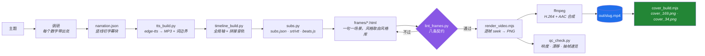

<div align="center">

# html-explainer

**把一个主题做成有配音、有硬字幕、有封面的讲解视频 —— 全本地、用 HTML 写画面，音画同步稳得住。**

面向 AI 编程智能体的确定性 HTML → MP4 渲染流水线。
不需要 Remotion，不需要云端渲染队列，没有按次计费，核心链路不需要任何 API key。

[](LICENSE)
[](CHANGELOG.md)
[](https://python.org)
[](https://nodejs.org)
[](#环境要求)
[](CONTRIBUTING.md)

[简体中文](README.md) · [English](README.en.md)

</div>

---

## 这是什么

`html-explainer` 用来生产科普 / 讲解 / 知识类视频 —— 就是那种带配音、带硬字幕、带进度条，
画面用 HTML/CSS/GSAP 做的动效视频。

你写一份解说词。智能体（或者你自己）从 23 种画面风格里挑一个，为每个节拍写一个自包含的
HTML 文件，然后这条流水线把它渲染成真正的 MP4：字幕逐字对齐，外加两张可直接上传的封面。

所有计算都在你自己的机器上。唯一的联网请求是 TTS 合成，以及（可选的）为写稿做的资料调研。

它以 **Agent Skill** 的形式封装（`SKILL.md` + `scripts/` + `references/`），可以直接放进
Claude Code、WorkBuddy、Cursor，或任何能读技能文件的智能体 —— 但脚本本身只是普通的
Python 和 Node，手工跑完全没问题。

---

## 核心思路：确定性 seek，而不是屏幕录制

多数「HTML 转视频」工具的做法是：启动浏览器、播放动画、录屏。这条路线会生出一整类让人
抓狂的 bug，因为它们都是**间歇性**的：动画在录制开始前就播了、网络字体加载晚了导致半段
视频用了错误的字体、前几帧拍到的是动画前的状态。

`html-explainer` 不录制，它 **seek**。

每一帧都执行这四步：

1. 置位 `window.__MG_RENDER__`，让画面知道自己不该自动起播；
2. 用 `tl.pause(t, false)` 把 GSAP 时间轴定位到那一瞬间；
3. 用 `document.getAnimations().currentTime = t * 1000` 同步所有 CSS 动画；
4. 等两个动画帧后截图。

渲染出来的第 1204 帧，和下一次渲染的第 1204 帧，逐像素一致。正是这个性质让后续的一切成为
可能 —— QC 可以定点抽查某一帧、单个场景可以独立重渲，而一整类时序 bug 从根本上无法发生。

> 第二个参数不是可选项。`pause(atTime, suppressEvents)` 的 `suppressEvents` 默认为 `true`，
> 它会**静默丢弃**这次 seek 触发的所有回调 —— 用 `onUpdate` 写的数字滚动会永远停在初值，
> 且零报错。这个坑花掉了真实的调试时间，见 [`references/lessons.md`](references/lessons.md) #27。

---

## 特性

| | |
|---|---|
| **节拍锚定解说词** | 画面按**匹配字幕文本**定位动画（`B('块文本')`），绝不硬编码帧号。改解说词，全片自动重排时间 —— **画面代码一行都不用改。** |
| **词边界字幕** | 时序来自 edge-tts 的 `WordBoundary` 事件，不按字数插值。中文里两个同字数的短语时长可以差 3 倍，插值会明显错位。 |
| **两级时钟** | 帧长用 MP3 **容器时长**（保证音画同步）；末块字幕按**语音真实结束**收尾。两者混用会让每场景字幕多停约 0.8 秒。 |
| **23 种画面风格** | 8 个类别 —— 大胆信号卡、奢华极简、NYT 编辑级数据图表、瑞士网格、故障艺术、胶片漏光、流体 Hero、品牌收尾等，每种都记录了画布、字阶、时间轴与配色纪律。 |
| **封面双方案** | 每条成片都附带 16:9 信息流封面与**独立排版**的 3:4 主页封面 —— 不是裁切，裁切会丢掉 57.8% 的画面宽度。 |
| **渲染前静态体检** | `lint_frames.py` 在你花 15 分钟渲染之前，先把八条画面契约的违规逐条报出来。 |
| **自适应 QC** | 响度、时长漂移、流完整性、抽帧速览图 —— 抽帧体积阈值取本片自身中位数推导，暗色主题不会产生假阳性。 |
| **结构性离线** | GSAP 内置；Chrome / Edge 自动探测；ffmpeg 缺失时回退到 `imageio-ffmpeg` 自带的静态二进制；网络字体被契约禁止。 |
| **配色单一来源** | 所有颜色都是 `theme.css` 里的 CSS 变量。换主题即整片换肤，画面代码零改动。 |

---

## 横向对比

| | `html-explainer` | 录屏式 HTML 工具 | Remotion | 云端视频 API |
|---|---|---|---|---|
| **渲染方式** | 确定性 seek | 实时录制 | React → 逐帧 | 服务端渲染 |
| **帧可复现** | 是 | 否 | 是 | 不适用 |
| **单次成本** | 零 | 零 | 零 | 按量计费 |
| **运行时依赖** | Node + Python + 浏览器 | 同上 | Node + React 工具链 | 网络 + 账号 |
| **创作模型** | 每场景一个 HTML | 每场景一个 HTML | React 组件 | JSON / 模板 |
| **改稿后重新对时** | 自动（`B()` 节拍） | 手工 | 手工 | 手工 |
| **全程离线可跑** | 是 | 是 | 是 | 否 |
| **内置风格库** | 23 种（含规范文档） | 视情况 | 社区模板 | 厂商模板 |
| **封面 / 缩略图产出** | 两套已验证版式 | 无 | 无 | 有时有 |

诚实的取舍：因为渲染是 seek 式的，**每一个动画都必须可 seek**。墙钟动画（`setInterval`、
`requestAnimationFrame` 计数、CSS `transition` 入场）不可能工作，会被 linter 直接拒绝。
这个约束换来了确定性 —— 而且它是被强制执行的，不只是写在文档里的建议。

---

## 流水线



顺序不能乱。`beats.js` 由 TTS 产出推导而来 —— 这就是为什么改了解说词之后，下游全部自动
重排时序，而场景代码完全不用动。

---

## 环境要求

| 项 | 最低 | 说明 |
|---|---|---|
| Python | 3.9+ | `edge-tts==7.2.8`（刻意钉死 —— v7 改过边界 API）、`numpy`、`pillow`、`imageio-ffmpeg` |
| Node.js | 18+ | 渲染器与封面器用 |
| 浏览器 | Chrome 或 Edge | 自动探测。都没有才下载 playwright chromium（约 115MB，只需一次） |
| ffmpeg | 任意版本 | 先在 `PATH` 找；没有则用 `imageio-ffmpeg` 自带的静态二进制 |
| 磁盘 | 每条成片约 2GB | 帧 PNG 体积大，合成后可删 |

全程不需要管理员权限，依赖一律装用户级。

---

## 快速开始

```bash
git clone https://github.com/OneMoh/html-explainer.git
cd html-explainer

# 1 · 环境自检（缺什么报什么）
bash setup_env.sh

# 2 · 安装缺失依赖
bash setup_env.sh --install
```

然后在项目目录里跑流水线：

```bash
PY=<你的 venv python 路径>     # 派给子智能体时要展开成绝对路径
SKILL=$(pwd)                  # 本仓库

# 阶段 0 —— 建项目脚手架
"$PY" "$SKILL/scripts/new_project.py" ~/videos/ai-intro ai-intro --topic "人工智能"
cd ~/videos/ai-intro

# …写 narration.json、填 project.json 的 order、
#   并为每个场景写一个 frames/<id>.html…

# 阶段 1–3 —— 配音、全局轴、字幕
"$PY" "$SKILL/scripts/tts_build.py"      --project .
"$PY" "$SKILL/scripts/timeline_build.py" --project .
"$PY" "$SKILL/scripts/subs.py"           --project .

# 阶段 4 —— 渲染前先体检画面（省下整片渲染的时间）
"$PY" "$SKILL/scripts/lint_frames.py"    --project .

# 阶段 5 —— 渲染（--preview 30 先出前 30 秒的快速样片）
node "$SKILL/scripts/render_video.mjs" . --preview 30

# 阶段 6 —— QC
"$PY" "$SKILL/scripts/qc_check.py"       --project .

# 阶段 7 —— 全片渲染 + 封面
node "$SKILL/scripts/render_video.mjs" .
node "$SKILL/scripts/cover_build.mjs"  .
```

产物在 `out/`：`slug.mp4`、`cover_169.png`、`cover_34.png`、`slug.srt`、`slug.vtt`，
外加 `qc_report.md` 与 `qc_sheet.jpg`。

> **只要打算复用渲出来的 PNG，就一定要加 `--keep-frames`。** 预览模式在合成后会按设计
> 清空帧目录。见 [`references/lessons.md`](references/lessons.md) #32。

---

## 命令参考

### 主流水线

| 命令 | 作用 |
|---|---|
| `python scripts/new_project.py <dir> <slug> [--topic T] [--preset P] [--fps 30] [--width 1920] [--height 1080] [--lang zh]` | 建项目脚手架：配置、主题、模板，以及两份封面 HTML |
| `python scripts/tts_build.py --project . [--voice V] [--rate +8%] [--no-trim] [--no-cache]` | 合成配音；带缓存、超时、退避重试、裁静音；写两种时长口径 |
| `python scripts/timeline_build.py --project . [--gap SEC]` | 生成全局时间轴并拼接 `narration-full.mp3` |
| `python scripts/subs.py --project . [--fps N]` | 产出 `subs.json`、`srt`/`vtt` 外挂字幕，以及每场景一份 `beats.js` |
| `python scripts/lint_frames.py --project . [--only id,id] [--include-covers]` | 按八条契约静态体检所有画面帧 |
| `node scripts/render_video.mjs <dir> [--out PATH] [--preview SEC] [--fps N] [--concurrency N] [--jpeg] [--scale N] [--keep-frames] [--browser PATH]` | 渲染并合成 MP4 |
| `python scripts/qc_check.py --project . [--samples N]` | 响度 / 时长 / 流体检 + 抽帧速览图 |
| `node scripts/cover_build.mjs <dir> [--at last\|SEC] [--only 169\|34] [--scale N] [--jpg] [--keep-frames]` | 渲两张封面，默认 2 倍图 |

### 辅助工具

| 命令 | 作用 |
|---|---|
| `node scripts/peek_frame.mjs <dir> <id> [--at 40,80]` | 给单个场景在若干百分比时点截图 —— 是「秒级」而不是「分钟级」。`--all` 可覆盖全部场景 |
| `python scripts/make_theme.py --topic "医疗" --use` | 按主题词推导配色，或用 `--preset violet\|cyan\|amber\|mono` |
| `python scripts/check_integrity.py` | 版本号 / 风格目录 / 计数一致性 + 外链扫描（CI 也会跑） |
| `bash setup_env.sh --install` | 环境自检与依赖安装 |
| `python scripts/package_skill.py [--with-deps]` | 打成可移植 zip（不加 `--with-deps` 约 110KB） |

---

## `B()` 节拍系统

这是让整个工作方式变掉的那一块。

`subs.py` 为每个场景生成一份 `beats.js`，把每块字幕按**原文**暴露出来：

```js
B('右边卡片')      // 「右边卡片」这几个字开始被念出的那一秒
Be('证据')         // 这句话念完的那一秒
```

于是画面动画可以这样写：

```js
var tl = gsap.timeline({ paused: true });
window.__tl = tl;

tl.fromTo('.card',   { y: 60, autoAlpha: 0 }, { y: 0, autoAlpha: 1, duration: 0.7 }, B('右边卡片'));
tl.fromTo('.verdict',{ scale: 0.8 },          { scale: 1, duration: 0.6, ease: 'back.out(2)' }, B('结论句') + 0.2);
```

改一次解说词，重跑三条命令。节拍随之平移，所有场景自行重排对时，没有一个画面文件被改动。
对比帧号硬编码的写法：改一句话意味着整片手工重新对位。

**兜底写法是被禁止的。** `B('x') || 3.2` 会把「节拍查不到」这件事藏在一个过期的数字后面。
查不到就应该让构建直接失败 —— 一条对错了时间的视频，比一次构建失败糟糕得多。

---

## 画面风格库

**不要对着空白页从零设计画面。** 23 种风格、8 个类别，每种都记录了画布、字阶、时间轴结构与
配色纪律（[`references/style-catalog.md`](references/style-catalog.md)）。

| 类别 | 风格 |
|---|---|
| 演示 / 标题卡 | 大胆海报帧、大胆信号卡帧、奢华极简留白帧、创意电压分屏帧、电光工作室分屏帧、故障艺术标题帧、Kinetic Type、Swiss Grid、Warm Grain |
| 数据可视化 | NYT 风数据图表帧、数据滚动帧、NYT Graph、瑞士网格数据帧 |
| 图解 / 流程 | 东方柔和有机帧、Decision Tree |
| 氛围 / 空镜 | 胶片漏光电影帧 |
| 营销 / Hero | 流体背景 Hero 帧 |
| 片头片尾 | 品牌 Logo 收尾帧 |
| 社媒竖版（9:16） | Play Mode、Vignelli |
| 产品演示 | Product Promo、Product Promo · 30s |
| 特效 | VFX 文字光标 |

分成两类，改编成本差别很大：

- **`rich`（12 个）** —— 单文件 + 纯 CSS `@keyframes` 驱动。seek 渲染器**零改动即可驱动**；
  改编只要三步：把网络字体换成系统字体栈、把底部元素抬出字幕带、填进真实内容。
- **`gsap`（11 个）** —— 多 composition + CDN 加载。**不要搬代码。** 多场景组合在单个可
  seek 的帧里没有起播钩子，整段搬进来只会得到静止首帧，而且零报错。只取它的视觉 DNA，
  用 CSS keyframes 重新表达。

一个项目建议轮换 2–4 种风格。8 个场景共用同一张脸会显得单调；用一个强冲击开场、一段留白
论述、一个理性数据收尾，观感完全不同。

---

## 封面双方案

每条成片产出**两张互为姊妹、而非裁切关系**的封面。

从 16:9 居中裁 3:4，1920px 只剩 810px —— 丢掉 **57.8% 的画面宽度**。任何横跨全宽的标题都会
被切掉一半。所以两张封面共享同一套视觉基因（配色、幕底、主视觉、钩子文案），但各自**重新
排一次版**：

| 元素 | 16:9（`1920×1080`） | 3:4（`1440×1080`） |
|---|---|---|
| 悖论视觉 | 右侧，左右并置 | 上方，竖排堆叠 |
| 钩子 | 左下，两行，≥96px | 下方，三行，≥120px |
| 角标 | 左上 | 顶部居中或省略 |
| 每行字数上限 | 7 字 | 5 字 |

三个要素缺一即返工：一句**真正有张力**的大字钩子、一个**在讲矛盾**的主视觉（两个数字反向
运动、一道分裂线、一明一暗 —— 不是装饰图形）、以及四边都留有余量（≥96px / ≥110px）。

默认输出 2 倍图：`3840×2160` 与 `2880×2160`，用来应付平台压缩。

完整规则与上传前自检清单：[`references/cover-guide.md`](references/cover-guide.md)。

---

## 画面契约

一个场景 = 一个自包含 HTML 文件。八条规则 —— 由 `lint_frames.py` 强制执行，每一条的存在
都是因为违反它会**静默失败**：

| # | 规则 | 违反了会怎样 |
|---|---|---|
| 1 | 画布 `1920×1080`（或 `project.json` 声明的尺寸），只用系统字体 | 渲染视口即画布 |
| 2 | **绝不引外部字体或 CDN** | 字体请求超时，片中字重跳变 |
| 3 | 颜色只取 `../theme.css` 的变量 | 换主题变成半换皮 |
| 4 | GSAP 时间轴注册到 `window.__tl` | 渲染器找不到时间轴，直接报错 |
| 5 | 用 `B('块文本')` 定位动画 | 画面与配音变成两张皮 |
| 6 | 底部 80–170px 保持干净（字幕带） | 字幕压字，两边都读不清 |
| 7 | 每帧一个焦点，文字 ≥22px | QC 退回 |
| 8 | GSAP 从 `../assets/gsap.min.js` 加载 | CDN 不可达 → 离线渲染失败 |

帧里的数字滚动应该用**纯 transform 的「数字卷轴」**，而不是 `onUpdate`。渲染器已经传
`suppressEvents = false` 让回调能跑，但基于 transform 的动画不依赖任何回调，因此在任何
seek 策略下都成立。

细则、版式基因与反例：[`references/frame-contract.md`](references/frame-contract.md)。

---

## 目录结构

```
html-explainer/
├── SKILL.md                      # 面向智能体的入口：流程、命令、契约
├── README.md                     # 本文档（中文，默认）
├── README.en.md                  # 英文版
├── LICENSE · THIRD_PARTY_NOTICES.md · licenses/
├── CHANGELOG.md · CONTRIBUTING.md
│
├── scripts/
│   ├── new_project.py            # 建项目
│   ├── tts_build.py              # edge-tts → MP3 + 词边界
│   ├── timeline_build.py         # 全局轴 + 拼接音轨
│   ├── subs.py                   # 字幕三出口 + beats.js
│   ├── lint_frames.py            # 渲染前契约体检
│   ├── render_video.mjs          # 确定性 seek 渲染器
│   ├── qc_check.py               # 成片体检 + 抽帧速览图
│   ├── cover_build.mjs           # 封面双方案渲染器
│   ├── peek_frame.mjs            # 单场景速览截图
│   ├── make_theme.py             # 推色 → theme.css
│   ├── check_integrity.py        # 仓库自洽性（CI）
│   ├── import_styles.py          # 一次性风格目录导入工具
│   └── package_skill.py          # 可移植 zip 打包
│
├── references/
│   ├── style-catalog.md / .json  # 23 种风格 / 8 个类别
│   ├── template-guide.md         # 改编三步法 / 重写法
│   ├── frame-contract.md         # 八条契约与理由
│   ├── cover-guide.md            # 封面双方案详规
│   ├── workflow-guide.md         # 阶段详解 + agent prompt 模板
│   └── lessons.md                # 34 条静默失败复盘
│
├── assets/
│   ├── frame-template.html       # 场景模板
│   ├── cover-template.html       # 封面模板
│   └── gsap.min.js               # GSAP 3.13，内置供离线渲染
│
├── node/                         # 随包 playwright-core
├── setup_env.sh                  # 环境自检 / 安装
└── .github/workflows/ci.yml      # CI：自洽性、语法、外链扫描
```

一个 **视频项目** 长这样：

```
my-video/
├── project.json      # slug、fps、尺寸、音色、语速、场景顺序、章节
├── narration.json    # [{ id, text }] —— 用 "|" 切字幕块
├── theme.css         # 所有颜色，以 CSS 变量形式
├── frames/
│   ├── _template.html
│   ├── <id>.html     # 一个场景一个文件
│   ├── <id>.beats.js # 自动生成 —— 绝不手改
│   ├── cover_169.html
│   └── cover_34.html
├── audio/  render/  research/  script/
└── out/              # MP4、封面、SRT/VTT、QC 报告
```

---

## 配置说明

`project.json`：

| 字段 | 含义 |
|---|---|
| `slug` | 输出文件名主干 |
| `lang` | `zh` 或 `en` —— 决定默认音色 |
| `fps` | 帧率（默认 30） |
| `width` / `height` | 画布尺寸（默认 `1920×1080`） |
| `gap` | 场景之间插入的静音秒数 |
| `order` | 场景 ID 的播放顺序 —— **写完 `narration.json` 后必须填** |
| `chapters` | 可选 `[{ title, startSegment }]`，给进度条加章节刻度 |
| `theme` | 主题预设名 |
| `voice` | edge-tts 音色，如 `zh-CN-YunxiNeural` |
| `rate` | 语速，如 `+8%` |
| `progress` | 是否渲染全局进度条 |

写解说词：

```json
[
  { "id": "hook",   "text": "开场钩子，一到两句。|用竖线切字幕块，每块不超过16个字。" },
  { "id": "point1", "text": "一个场景一句解说。|字幕块之间用竖线分隔。" }
]
```

- `id` 会成为场景名，必须是 ASCII（`hook`、`point1`、`ending`）。
- `|` 切的是**字幕块**，不是场景。一条解说词 = 一个场景。
- 中文字幕每块 ≤16 字，切点落在语义边界上。
- 不要靠加回标点来控制断行 —— 渲染器把字幕当作屏幕文本，会去掉标点。
- **相邻的两个数字之间要插中文逗号**，否则 edge-tts 会把它们熔成一个数
  （`沪深300` + `4479.55` → 「三百万四千四百七十九点五五点」）。

中文语速约 5.4–6 字/秒。如果总时长偏离目标超过 15%，改句子 —— 不要扭曲语速去硬凑。

---

## 疑难排查

| 症状 | 原因 | 处理 |
|---|---|---|
| 每一帧都是静止首帧，且不报错 | 时间轴没注册到 `window.__tl`；或 `page.evaluate` 传了**字符串**而不是函数字面量（Playwright 只把字符串求值一次，返回的是函数对象，函数体根本不执行） | 注册时间轴；传真正的函数字面量。lessons #17 |
| 数字能渲染，但永远不动 | seek 抑制了 `onUpdate` 回调 | 渲染器已修（`pause(t, false)`）。帧里改用 transform 数字卷轴。lessons #27 |
| 视频变成 1280×720 而不是 1920×1080 | `viewport` 传给了 `browser.launch()` —— 它是 *context* 级选项 | 传给 `newPage()`。lessons #18 |
| 封面出成 1 倍图，但日志写着 2 倍 | 同上，`deviceScaleFactor` 的孪生坑 | 传给 `newPage()` + `screenshot({ scale: 'device' })`；用 PIL 核尺寸。lessons #28 |
| Windows 上 `No such file or directory` | 非 ASCII 路径 —— Windows 的 ffmpeg 把 UTF-8 当 ANSI 读 | 项目、输出、抽帧路径全部保持 ASCII。lessons #11 |
| Node 找不到 `/tmp/...` | Git Bash 的 `/tmp` ≠ Node 的 `/tmp` | 传 `C:/...` 正斜杠绝对路径。lessons #12 |
| QC 把所有帧都报成可疑 | 抽帧体积阈值写死了，在暗色主题上失效 | 已改为自适应（本片中位数的 35%）。lessons #19 |
| QC 说全过，但后半段其实一帧没抽 | 抽样逻辑取了前 N 块，而不是按步长均匀挑 | 已修。lessons #29 |
| 末块字幕提前消失 | `speech_end_sec` 用了裁前坐标 | 1.2.2 已修。lessons #31 |
| 视频前 0.5 秒几乎全黑 | 第一句解说配了从 `opacity: 0` 开始的淡入 | 提前入场起点、换 `power4.out`，并让遮罩上推本身去提供遮挡而不是叠加透明度。lessons #34 |
| 预览渲完，帧 PNG 不见了 | 预览模式按设计会清空帧目录 | 加 `--keep-frames`。lessons #32 |
| 为了修一个场景重渲了整片 | 渲染器没有单场景开关 | 用临时项目法。lessons #33 |

**`references/lessons.md` 是这个仓库里最值钱的文件。** 34 条编号记录，每一条都是一个
「成片看着挺正常、其实是错的」的 bug —— 包括它一开始是怎么被误判的。从零开始 debug 之前，
先读它。

---

## 适合谁

**适合**

- 想成规模地把文章、文档或某个主题做成带解说的视频。
- 已经在用 AI 编程智能体，并且宁愿用 HTML 描述画面，也不想学一套动效软件。
- 需要可复现的输出 —— 同一个项目重渲一次，帧应当一致。
- 需要离线跑，或者不接受按次计费。
- 想把字幕、音画同步、封面、QC 这些基础工程直接拿走用。

**不适合**

- 实拍剪辑、真人口播，或者复刻一条已有的视频。
- 想把「React 组件动画」作为创作模型（那是本项目的姊妹项目、基于 Remotion 的
  `anything2explainer` 的领域）。
- 想要图形化拖拽编辑器。画面是代码，这是刻意选择。

---

## 路线图

- [ ] 单场景渲染开关（`--only <id>`）—— 目前需要临时项目法绕过
- [ ] 封面排版终态测量器（行数 / 四边边距 / 元素重叠 / 钩子字号一次判完）—— 目前需自行写十几行
- [ ] 通过 `cover_build.mjs` 里的规格表支持更多封面比例
- [ ] 风格目录补英文说明（目前描述以中文为主）
- [ ] 可选背景音乐轨，并对解说自动做闪避（ducking）
- [ ] 「焦点 / 发光纪律」的 lint 规则（目前只能靠肉眼）
- [ ] 常见视频形态的项目模板（60 秒短片、3 分钟讲解）

---

## 参与贡献

欢迎提 issue 和 PR。最有价值的贡献，是一条**已被定位的静默失败**，加进
`references/lessons.md` —— 写下它一开始是怎么误导你的、证明病因的证据、修法，以及由此
得出的通用规则。

请先读 [`CONTRIBUTING.md`](CONTRIBUTING.md)，里面有本项目的硬性规则、端到端自检方法，
以及 PR 检查清单。

CI 会在 Linux 与 Windows 上、Python 3.9 与 3.13 上检查版本号漂移、风格目录漂移和外链引用。

---

## 致谢

本项目的解说与音画同步方法论 —— 词边界字幕、两级时钟、语速标定、QC 判据 —— 源自作者
更早的两个项目 `anything2explainer` 与 `html-video-workbuddy-driver`。

23 种画面风格目录转写自 [nexu-io/html-video](https://github.com/nexu-io/html-video)
（Apache-2.0）的模板设计规范。其中 7 种风格又可追溯到 MIT 许可的设计作品，作者分别是
[Zara Zhang](https://github.com/zarazhangrui/frontend-slides)、
[alchaincyf](https://github.com/alchaincyf/huashu-design) 与 Nate Herk。

本仓库不打包、运行时不依赖任何上游源码 —— 风格目录是一份文字规范，类比把菜谱抄回家。
完整的署名、许可证原文与逐风格对应关系见
[`THIRD_PARTY_NOTICES.md`](THIRD_PARTY_NOTICES.md)。

GSAP 按 GreenSock 的 [standard "no charge" 许可](https://gsap.com/standard-license) 内置。

---

## 许可

[MIT](LICENSE) © 2026 Moh

MIT 许可覆盖原创代码与文档。第三方组件与衍生出的风格规范仍适用其各自的条款 —— 见
[`THIRD_PARTY_NOTICES.md`](THIRD_PARTY_NOTICES.md)。

---

<div align="center">

**作者：Moh**

做这个项目，是因为「改一句话然后把整片手工重新对位一遍」实在不是一种好的过下午的方式。

</div>
