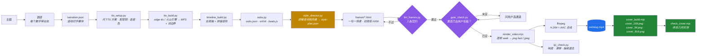

<div align="center">

# html-explainer

**一个 Agent Skill：给任意主题，产出一条带配音、硬字幕、封面的讲解视频。**

HTML 写画面 → 确定性逐帧渲染 → 真 MP4。全本地跑，核心链路零 API key、零按次计费。

画面用一套可 seek 的动效库写，风格由主题驱动编排，渲染支持 4K60、快门运动模糊与多进程并行。

[](LICENSE)
[](CHANGELOG.md)
[](SKILL.md)
[](#安装)
[](#安装)
[](#安装)
[](#环境要求)
[](#环境要求)

[简体中文](README.md) · [English](README.en.md)

<br/>

两条用本技能生成的成片——画面、配音、字幕、封面全部由流水线产出，无手工后期。
封面等素材托管在[演示仓库](https://github.com/OneMoh/html-explainer-demos)，本仓库零体积。

| 港股创新药 · 早盘 | 量化简史 |
|---|---|
| https://github.com/user-attachments/assets/8007843c-088d-457c-8550-81ec912e0add | https://github.com/user-attachments/assets/28949988-449b-4c4e-8d0f-6706af6f64ee |

</div>

---

## 它是什么

`html-explainer` 把一个主题做成**带配音、带硬字幕、带进度条**的讲解视频，画面用
HTML/CSS/GSAP 写。

它**是一个 Agent Skill**（`SKILL.md` + `scripts/` + `references/`），遵循
[Agent Skills](https://code.claude.com/docs/en/skills) 约定，Claude Code / OpenAI Codex /
WorkBuddy / Cursor / Gemini CLI 等都能直接加载。内部是普通的 Python 与 Node 脚本，
手工跑也完全没问题。

你只需要说一句：

> 把「为什么天空是蓝色的」做成一条 1 分钟的讲解视频。

技能会带着智能体走完：调研 → 解说词 → 配音 → 字幕与节拍 → **编排风格并写画面** → 渲染 → 体检 → 封面。

画面不必对着空白页从零写。技能内置一套**可 seek 的动效库**（40+ 动作词汇，见
[动效库与模板编排](#动效库与模板编排)），和一份**模板编排器** —— 它读解说词本身，判断每场在片子里
扮演什么角色，再挑风格、混用、决定开场与转场；渲染层则支持 4K60、快门运动模糊与多进程并行。
这些开关都是可选的：不带任何参数跑，就是一条最朴素的 1080p30 片子。

---

## 安装

### 一句话安装（推荐）

把下面这句发给你的智能体：

```text
给当前本地环境安装该 Skill：https://github.com/OneMoh/html-explainer.git
安装到你的技能目录，并检测安装必要的运行环境（Python 3.9+ / Node 18+ / Chrome 或 Edge / ffmpeg）
```

它会自己 clone 到对应目录、跑环境自检、把缺的东西装上。装完**新开一个会话**，让智能体重新
扫描技能目录。

### 手动安装

仓库根目录**就是**技能目录（`SKILL.md` 在根），直接 clone 进技能目录即可，不用再拷子目录：

```bash
git clone https://github.com/OneMoh/html-explainer.git ~/.workbuddy/skills/html-explainer
bash ~/.workbuddy/skills/html-explainer/setup_env.sh --install
```

Windows 上 `~` 就是 `C:\Users\<你的用户名>`。

### 各智能体的技能目录

| 智能体 | 个人级（全局） | 项目级（仓库内） |
|---|---|---|
| **WorkBuddy** | `~/.workbuddy/skills/` | `<工作区>/.workbuddy/skills/` |
| **Claude Code** | `~/.claude/skills/` | `.claude/skills/` |
| **OpenAI Codex** | `~/.codex/skills/` | `.codex/skills/` 或 `.agents/skills/` |
| **Gemini CLI** | `~/.gemini/skills/` | `.gemini/skills/` 或 `.agents/skills/` |
| **Cursor** | `~/.cursor/skills/` | `.cursor/skills/` |
| **GitHub Copilot / VS Code** | `~/.copilot/skills/` | `.github/skills/` |
| **OpenCode** | `~/.config/opencode/skills/` | `.opencode/skills/` |
| **Windsurf** | `~/.windsurf/skills/` | `.windsurf/skills/` |
| 其他（通用约定） | `~/.agents/skills/` | `.agents/skills/` |

记不住放哪：优先 `.agents/skills/`，多数工具都认它（Claude Code 是例外，只认
`.claude/skills/`）。

### 环境要求

| 项 | 最低 | 说明 |
|---|---|---|
| Python | 3.9+ | `edge-tts==7.2.8`（刻意钉死 —— v7 改过边界 API）、`numpy`、`pillow`、`imageio-ffmpeg`。**火山引擎引擎零额外依赖**（只用标准库 `urllib`，不需要装 SDK） |
| Node.js | 18+ | 渲染器与封面器用 |
| 浏览器 | Chrome 或 Edge | 自动探测；都没有才下载 playwright chromium（约 115MB，只需一次） |
| ffmpeg | 任意版本 | 先在 `PATH` 找；没有则用 `imageio-ffmpeg` 自带的静态二进制 |
| 磁盘 | 每条成片约 2GB | 帧 PNG 体积大，合成后可删 |

`bash setup_env.sh` 只检查并报告缺什么，`--install` 才会装。全程不需要管理员权限。
动效库、编排器与全部渲染档位都只用上面已声明的库，**没有引入任何新的运行时依赖**。

---

## 配音：两个引擎

流水线开始前，智能体会**先问你用哪个 TTS**，再列候选音色让你挑（也可以直接给它音色 ID）：

| | `edge-tts` | 火山引擎语音合成 2.0 |
|---|---|---|
| 你要做什么 | 什么都不用做 | 填一次 API Key |
| 费用 | 免费 | 按字符计费 |
| 音色 | 内置中英文若干 | 豆包 2.0 音色库，含声音复刻 |
| 字级时间戳 | `WordBoundary` | `sentence.words[]` |
| 额外依赖 | `edge-tts==7.2.8`、`imageio-ffmpeg` | **零** —— 只用标准库 `urllib` |
| 什么时候选它 | 默认。开箱可用、够用 | 想要更自然的语气与更好音质 |

两者产出的 `audio-manifest.json` **结构完全一致**，所以时间轴、字幕、渲染**全都不用改** ——
换引擎只是换一个字段的事。

### 选火山时，你唯一要动手的地方

技能第一次跑火山时会**生成一个 `tts.env` 并停下来**，然后告诉你把 API Key 填进去
（火山控制台 → 语音技术 → API Key 管理）。你填好回来说一声，智能体就去测连接、确认音色，
然后接着往下跑。

**这一步刻意不经过对话窗口** —— 密钥不发给智能体，智能体也不需要知道它。

内置常用音色（完整列表见[官方音色文档](https://docs.volcengine.com/docs/6561/1257544)）：

| 男声 | 女声 |
|---|---|
| 云舟 2.0（默认）· 温暖阿虎 2.0 · 解说小明 2.0 · 磁性解说男声 2.0<br>悬疑解说 2.0 · 广告解说 2.0 · 儒雅青年 2.0 · 少年梓辛 2.0 · 深夜播客 2.0 | 小何 2.0 · Vivi 2.0 · 知性灿灿 2.0<br>甜美桃子 2.0 · 邻家女孩 2.0 · 温柔淑女 2.0 |

内置列表不够用时，也可以直接用声音复刻出来的音色 ID。

### 密钥纪律

API Key 只存在 `tts.env` 里，而且**只有技能里的一个接口包读它**。
智能体调的是那个接口包，拿不到、也不需要读密钥的值：

```
你（手工填一次）→ tts.env（已被 .gitignore 忽略）
                      ↓  只有接口包读
               合成调用  ← 智能体只调这个，永远拿不到密钥值
                      ↓
               火山引擎
```

- **不进对话**：问智能体密钥状态，它给你的是脱敏摘要（`ef90******86c8`）。
- **不进仓库**：`.gitignore` 覆盖 `tts.env` / `*.env` / `*.key` / `*.pem` / `secrets/`；
  仓库自检里有专门的**密钥防线**，并且做过反向自证 —— 故意植入一个假密钥会被当场抓到。
- **不进日志**：出错信息过脱敏，只抹「这次实际用到的密钥值」与 `AKLT…` 形态的 token ——
  刻意**不**用「长字符串就算密钥」这种宽规则，否则连排查要用的请求 ID 一起抹掉。
- **不进分发**：技能打包时排除密钥文件。
- **兜底层**（真正的安全边界）：万一还是泄了，损失要可控 —— 建议在火山控制台用
  **子账号只授语音合成权限**、设**用量告警与限额**，密钥**可随时轮换**。

> 说句实话：合成代码是在你本机执行的，运行时进程里密钥对那一段脚本可见，
> **「智能体绝对读不到」做不到**。上面保证的是**不进对话、不进仓库、不进日志、不进分发**，
> 把泄露半径收敛成一次可撤销的事故。
>
> 另外**别用环境变量存密钥** —— 很多宿主会把进程环境原样打进会话记录。

**别把 `tts.env.example` 改名成 `tts.env` 去填**：那是要留在仓库里的模板，
改名会让后来的人没模板可抄（仓库自检会报错并提示）。复制一份再填。

---

## 视频项目结构

说一句需求，智能体会在一个**视频项目目录**里走完整个流水线；产物落在 `out/`：
`slug.mp4`、`cover_169.png`、`cover_34.png`、`slug.srt`、`slug.vtt`，外加 `qc_report.md`
与 `qc_sheet.jpg`；做竖版投放时再加一张 `cover_916.png`。

项目目录长这样：

```
my-video/
├── project.json      # slug、fps、尺寸、音色、语速、场景顺序、章节
├── narration.json    # [{ id, text }] —— 用 "|" 切字幕块
├── theme.css         # 所有颜色，以 CSS 变量形式
├── style-plan.json   # 每场的主/次风格、角色、转场、动效强度（编排器产出）
├── consent.json      # 六个确认点（含渲染通道）由用户拍板才放行
├── frames/           # 一个场景一个 HTML；<id>.beats.js 自动生成，绝不手改
├── audio/  render/  research/  script/
└── out/              # MP4、封面、SRT/VTT、QC 报告
```

---

## 为什么不用录屏

多数「HTML 转视频」工具是启动浏览器、播放动画、录屏。这条路会生出一整类**间歇性** bug ——
动画在录制开始前就播了、网络字体加载晚了导致半段视频用了错误字体、前几帧拍到的是动画前的状态。

`html-explainer` 不录制，它 **seek**：把 GSAP 时间轴定位到那一瞬间
（`tl.pause(t, false)`），同步所有 CSS 动画（`document.getAnimations().currentTime`），
等两个动画帧后截图。于是第 1204 帧与下一次渲染的第 1204 帧逐像素一致 —— QC 可以定点抽查、
单个场景可以独立重渲，一整类时序 bug 从根本上无法发生。

代价是**每个动画都必须可 seek**：墙钟动画（`setInterval`、`requestAnimationFrame` 计数、
CSS `transition` 入场）不可能工作，会被 `lint_frames.py` 直接拒绝。这也正是动效库被设计成
「`t` → 一组数字」的纯函数的原因：它天生可 seek。

---

## 特性

| | |
|---|---|
| **节拍锚定解说词** | 画面按**匹配字幕文本**定位动画（`B('块文本')`），绝不硬编码帧号。改解说词，全片自动重排时间，画面代码零改动。 |
| **词边界字幕** | 时序来自 TTS 的**字级时间戳**，不按字数插值 —— 中文里两个同字数的短语时长可以差 3 倍。edge-tts 取 `WordBoundary`，火山引擎取 `sentence.words[]`。 |
| **两个配音引擎** | `edge-tts`（免费、免密钥、默认）或**火山引擎语音合成 2.0**（音质更好，需 API Key）。两者产出的 manifest 结构一致，下游零改动。切换用 `--provider`。 |
| **密钥不进 agent、不进仓库** | 火山 API Key 只存 `tts.env`（已 gitignore），**只有接口包读它** —— agent 只调 `tts_volcano.py`，拿不到也不需读密钥。异常信息脱敏；`check_integrity.py` 有专门的密钥防线检查；打包排除密钥文件。 |
| **两级时钟** | 帧长用 MP3 **容器时长**（保音画同步）；末块字幕按**语音真实结束**收尾。 |
| **23 种画面风格** | 8 个类别，每种都记录了画布、字阶、时间轴与配色纪律。不用对着空白页从零设计。 |
| **动效库（40+ 动作词汇）** | `assets/motion.js` 把「镜头语言」变成**时间的纯函数**：入场 / 承接 / 接触 / 运镜 / 环境五组。无状态、可组合、可逐帧 seek；随机数走 `seededRng`，渲染路径上不出现 `Math.random()`。 |
| **主题驱动模板编排** | `style_director.py` 读解说词推断每场角色（开场/陈述/数据/原理/例证/收束），挑主风格 + 搭次风格 + 决定开场变体与转场。**不再是「一片一模板」**，产物里每场都有 `why` 说明。 |
| **多画幅封面** | 每条成片附 16:9 与**独立重排**的 3:4 封面（不是裁切 —— 裁切会丢掉 57.8% 的画面宽度）；竖版投放再加 9:16。`check_cover.mjs` 量终态几何把关。 |
| **画质 × 帧率档位** | `--profile draft\|balanced\|final\|master\|legacy`，或 `--quality 1080p\|2k\|4k` × `--fps 30\|60` 自由组合。画质只改 `deviceScaleFactor`，**布局逐像素不变**。`legacy` 逐位复现 v1.4 旧成片。 |
| **快门运动模糊** | `--shutter 180` 在**线性光下做多样本积分**（不是 blur 滤镜）；静帧只截两张就跳过。三级闸门（`--shutter-only` / `--motion-hold`）避免把成本花在静态帧上。 |
| **多进程并行 + 断点续渲** | `--workers N` 起 N 个独立浏览器进程（截图是 CPU 活，能拉满多核）；`--resume` 跳过已积分的帧；`--recycle N` 长片定期重启浏览器防 OOM。 |
| **渲染通道由用户拍板** | 渲染前**必须**先问你选哪条中间帧通道（`png-fast`（★默认推荐）/ `jpeg q95` / `png` / `jpeg q82`），落进 `consent.json`，由 `gate_check.py --phase render` 挡在渲染之前。 |
| **渲染前体检 + QC** | `lint_frames.py` 在渲染前报出契约违规；`qc_check.py` 查响度、时长漂移、抽帧速览。 |
| **结构性离线** | GSAP 内置；浏览器自动探测；ffmpeg 缺失时回退到 `imageio-ffmpeg` 静态二进制；网络字体被契约禁止。 |

---

## 流水线


```mermaid
flowchart LR
    A["主题"] --> B["调研<br/><i>每个数字带出处</i>"]
    B -->     C["narration.json<br/><i>竖线切字幕块</i>"]
    C --> S["tts_setup.py<br/><i>问 TTS 方案 · 配密钥 · 选音色</i>"]
    S --> D["tts_build.py<br/><i>edge-tts / 火山引擎 → MP3 + 词边界</i>"]
    D --> E["timeline_build.py<br/><i>全局轴 + 拼接音轨</i>"]
    E --> F["subs.py<br/><i>subs.json · srt/vtt · beats.js</i>"]
    F --> SD["style_director.py<br/><i>读解说词挑风格 → style-plan.json</i>"]
    SD --> G["frames/*.html<br/><i>一句一场景 · 动效库 HXM</i>"]
    G --> H{"lint_frames.py<br/>八条契约"}
    H -->|不过| G
    H -->|通过| GC{"gate_check.py<br/>通道已由用户拍板？"}
    GC -->|未定| Q["问用户选通道"]
    Q --> GC
    GC -->|已定| I["render_video.mjs<br/><i>逐帧 seek → png-fast / jpeg</i>"]
    I --> J["ffmpeg<br/><i>H.264 + AAC 合成</i>"]
    J --> K[("out/slug.mp4")]
    I --> L["qc_check.py<br/><i>响度 · 漂移 · 抽帧速览</i>"]
    K --> M["cover_build.mjs<br/><i>cover_169.png · cover_34.png · cover_916.png</i>"]
    M --> N["check_cover.mjs<br/><i>终态几何实测</i>"]

    style K fill:#1f6feb,color:#fff
    style H fill:#8957e5,color:#fff
    style GC fill:#8957e5,color:#fff
    style SD fill:#bf8700,color:#fff
    style M fill:#238636,color:#fff
    style N fill:#238636,color:#fff
```

---

## 渲染：档位、提速与通道

「怎么渲」拆成两个正交的旋钮：**档位**（画质 × 帧率 × 快门 × 并行）与**中间帧通道**
（中间帧存成什么格式）。两者与最终编码质量（`--crf` / `--preset`）**解耦**。

### 档位

`--profile` 给的是成套预设；任何显式开关（`--quality / --fps / --shutter / --workers / --crf`）
都会**覆盖**档位里的对应项。查看全部档位：

```bash
node <skill>/scripts/render_video.mjs . --list-profiles
```

| 档位 | 画质 | 帧率 | 快门 | 中间帧 | 用途 |
|---|---|---|---|---|---|
| `legacy` | 1080p | 项目 fps | 关 | 精细 PNG | **逐位复现 v1.4.x 旧成片**（向后兼容的硬证据） |
| `draft` | 1080p | 30 | 关 | `png-fast` | 打样 / 迭代，最快 |
| `balanced` | 1080p | 30 | 180° | `png-fast` | **默认推荐**（质量/速度平衡） |
| `final` | 4K | 60 | 180° | `png-fast` | 终稿（4K60；原始工作量约 1080p30 的 8–12×，多进程可吸收大半） |
| `master` | 4K | 60 | 180° | 精细 PNG | 极限画质（很慢） |

画质只改 `deviceScaleFactor`（1× / 1.333× / 2×），**不改任何布局** —— 同一份 HTML 只是采样更密，
构图逐像素不变。

### 速度（实测）

一条 **3 分 20 秒 · 1080p30 · 5982 帧**的真实片子（本机 Windows 10 · 16 逻辑核 · Chrome ·
6 个浏览器进程 · 快门 180°/8 样本，只开在 3 场 = 35.3% 的帧上）：

| 阶段 | `--png-fast`（默认） | `--jpeg --jpeg-quality 95` |
|---|---|---|
| 截图（5982 帧 · 11995 次采样） | 365.4 s | 365.8 s |
| 快门积分 | 67.1 s | 63.0 s |
| 编码 + 收尾 | 36.8 s | 31.9 s |
| **端到端** | **469.2 s ≈ 7 分 49 秒** | 460.7 s ≈ 7 分 41 秒 |
| 成片体积 | **10.81 MB** | 11.02 MB |

派生指标：全片平均截图吞吐 **16.4 帧/秒**、平均单次截图 **30.5 ms**（含换场与预载开销）；
单场景热身后的峰值吞吐 **26.65 帧/秒**。**快门只吃掉 13.7% 的耗时** —— 因为它只落在 35.3% 的帧上。

**快的四个来源**（按杠杆大小排）：

1. **`--workers N` 真·多进程** —— 截图是纯 CPU 活，能拉满多核。`--concurrency` 完全无效
   （中间帧编码在浏览器进程内串行，实测并发 1/3/6 路吞吐 1.80 / 1.86 / 1.87 帧/秒）。
2. **换中间帧通道** —— 与并行同级的编码杠杆；`png-fast` 在纯图形帧上等于「同速 + 更小 + 无损」。
3. **`--shutter-only` 白名单** —— 快门是唯一按倍数付费的项。只给需要拖影的场景开，其余场零成本：
   本片 35.3% 的帧开了快门，却只贡献 13.7% 的耗时。
4. **`--profile draft` + `--preview`** —— 迭代期只看节奏：去掉快门、只渲一段，秒级出片。

> 上面是**一条真片子的端到端实测**，比合成微基准可信 —— 微基准的信噪比不足以预测全片收尾开销。
> 绝对值随机器与帧内容变化很大；换机器后请用自己的片子跑两遍同通道来标定基线。

### 中间帧通道（渲染前必问，★默认 `png-fast`）

| 通道 | 相对速度（纯图形帧 / 满幅照片帧） | 画质 | 体积（1080p 纯图形帧） | 定位 |
|---|---|---|---|---|
| **`--png-fast`** ★**默认** | **×1.02 / ×4.4** | **逐像素无损** | **0.10 MB/帧** | 纯 CSS/MG 图形帧上与 JPEG q95 同速、体积更小 → 默认用它 |
| `--jpeg --jpeg-quality 95` | ×1.00 / **×13** | PSNR 41.65 dB（低于成片自身失真） | 0.12 MB/帧 | **含满幅照片 / 重合成帧、或 4K 终稿**时的首选 |
| `--png` | ×1.16 / ×1.0 | 逐像素无损 | 0.08 MB/帧 | 只有 `legacy` 复现 / `master` 极限档用 |
| `--jpeg --jpeg-quality 82` | 最快 | 略低 | ~0.08 MB/帧 | 只做打样预览 |

> **口径陷阱：「×13 / ×4.4」是满幅照片帧的倍率，不要套到纯图形帧上。** 本技能绝大多数片子是
> 大面积平色 + 锐利文字的**纯 CSS/MG 图形帧**，PNG 的 deflate 对这类帧极其高效 —— 实测
> **JPEG q95 与 PNG-fast 同速**（27.14 vs 26.65 帧/秒，×1.02），而且 PNG-fast **体积更小、还无损**。
> 所以默认推荐是 `--png-fast`；`--jpeg q95` 只在**含照片 / 4K 终稿**时才是首选
> （照片帧上精细 PNG 是 582ms/帧的黑洞）。
>
> 端到端代价：同一条 5982 帧片子，JPEG q95 实测 460.7 s，PNG-fast **实测 469.2 s（+1.85%）** ——
> 逐像素无损几乎没有代价，成片体积还小了 0.21 MB。

通道由**你**拍板，不靠 agent 默认：选定值写进 `consent.json` 的 `render_channel`，
`gate_check.py --phase render` 在未拍板时**退出码 1**，挡住渲染。完整档位表、基准读法与
快门磁盘护栏见 [`references/render-profiles.md`](references/render-profiles.md)。

---

## `B()` 节拍系统

`subs.py` 为每个场景生成一份 `beats.js`，把每块字幕按**原文**暴露出来，于是画面动画可以直接
锚在吐字时刻上：

```js
tl.fromTo('.card',    { y: 60, autoAlpha: 0 }, { y: 0, autoAlpha: 1, duration: 0.7 }, B('右边卡片'));
tl.fromTo('.verdict', { scale: 0.8 },          { scale: 1, duration: 0.6 },        B('结论句') + 0.2);
```

`B('块文本')` 是「这几个字开始被念出」的时刻，`Be('块文本')` 是念完的时刻。

这是本项目自己的设计，也是让工作方式变掉的那一块：改一次解说词，重跑三条命令，所有场景自行
重排对时。对比帧号硬编码 —— 改一句话就是整片手工重新对位。

**兜底写法是被禁止的。** `B('x') || 3.2` 会把「节拍查不到」藏在一个过期的数字后面。查不到
就应该让构建直接失败 —— 一条对错了时间的视频，比一次构建失败糟糕得多。

---

## 画面风格库

**不要对着空白页从零设计画面。** 23 种风格、8 个类别，每种都记录了画布、字阶、时间轴结构与
配色纪律 —— 完整目录见 [`references/style-catalog.md`](references/style-catalog.md)。

涵盖：大胆信号卡 / 奢华极简留白 / NYT 编辑级数据图表 / 瑞士网格 / 故障艺术 / 胶片漏光 /
流体 Hero / 品牌 Logo 收尾 / VFX 文字光标 / 社媒竖版（9:16）/ 产品演示等。

分成两类，改编成本差别很大：

- **`rich`（12 个）** —— 单文件 + 纯 CSS `@keyframes`。seek 渲染器**零改动即可驱动**；改编
  只要三步：换系统字体栈、把底部元素抬出字幕带、填进真实内容。
- **`gsap`（11 个）** —— 多 composition + CDN 加载。**不要搬代码。** 只取它的视觉 DNA，用
  CSS keyframes 重新表达。

一个项目建议轮换 2–4 种风格。8 个场景共用同一张脸会显得单调 —— 编排器会自动把这件事做掉（见下）。

---

## 动效库与模板编排

### 动效库 —— 把镜头语言变成时间的纯函数

`assets/motion.js`（浏览器里挂到 `window.HXM`）把 23 个模板里反复出现的动作抽象成
**40+ 动作词汇**，分 5 组：

| 组 | 动作（节选） |
|---|---|
| `enter` 到场 | `riseWord` `dropLetters` `springIn` `blurAway` `riseFromMask` `typeChars` `checkOff` `flyPlane` |
| `carry` 承接 | `morphBox` `irisOpen` `diveInto` `arcHop` `gatherTo` `railShift` `sealDisc` `burstWord` |
| `contact` 接触 | `landHit` `splitOnHit` `tapPress` `pointer` `stretch2` `sim.*`（磁吸 / 跟随 / 软体 / 绳索） |
| `camera` 运镜 | `camTrack` `layerMatrix` `depthBlur` `whipPan` `camShake` `slowPush` `gridDots` + 坐标互转 |
| `ambience` 环境 | `swiftSpring` `glowField` `floodRings` `noiseField`（5 套色带） `beltLoop` |

每个动作都是 **`t`（绝对秒）→ 一组数字**：无状态、不碰 DOM、不碰 canvas，所以能被**逐帧 seek**
—— 同一个 `t` 永远给出同一组数。所有随机数走 `seededRng`，渲染路径上**不出现 `Math.random()`**，
逐帧渲染与实时预览结果一致。`tests/test_motion.mjs` 有 148 条断言。

写画面时不再是从零调缓动曲线，而是从这套词汇里挑选、组合、调参 —— 一个场景通常由
「入场 + 承接 + 一点运镜 + 环境光」几层叠出来。

### 模板编排 —— 让主题支配模板，而不是反过来

`scripts/style_director.py` **读解说词本身**，先推断每场在片子里扮演什么角色
（开场 / 陈述 / 数据 / 原理 / 例证 / 反差 / 收束 / 落版），再按角色 × 子类别 × 时长 × 内容词 ×
受众 × 节奏打分挑**主风格**，按能量预算给部分场搭**次风格**做局部元素替换，并决定**开场变体**
（由主题哈希轮换）与**场间转场**（由相邻两场能量差决定）：

```bash
# 先 dry-run 看结果，满意再去掉 --dry-run 落盘
python scripts/style_director.py --project . --dry-run
python scripts/style_director.py --project . --mood calm --pace 慢 --audience 大众 --pin hook=bold-signal
```

产物 `style-plan.json` 每场带 `role / primary / motion_intensity / transition_out / why` ——
「这场为什么被挑中」是可查的。多样性约束（风格数上限 / 连续同风格上限 / 开场 ≠ 第二场）与
`--pin` 硬约束，保证它不会又退化成「一片一模板」。`--seed` 让同一题材每次换一批画面，
`--band 0` 则完全确定（供回归）。完整规则见 [`references/style-director.md`](references/style-director.md)、
动效词汇见 [`references/motion-library.md`](references/motion-library.md)。

---

## 封面多画幅

每条成片产出**互为姊妹、而非裁切关系**的封面。从 16:9 居中裁 3:4，1920px 只剩 810px ——
丢掉 57.8% 的画面宽度，任何横跨全宽的标题都会被切掉一半。所以各画幅共享同一套视觉基因，
但各自**重新排一次版**：

| 元素 | 16:9（`1920×1080`） | 3:4（`1440×1080`） | 9:16（`1080×1920`） |
|---|---|---|---|
| 用途 | 信息流 / 播放页 | 主页栅格 | 竖版全屏 / 小红书 / 视频号竖版 |
| 构型 | 左右并置 | 上方竖排堆叠 | 三段式，重心偏上 |
| 钩子 | 左下，两行，≥96px | 下方，三行，≥120px | 中下，三行，≥130px |
| 每行字数上限 | 8 字 | 8 字 | 6 字 |
| 余量 | 四边 ≥96px | 四边 ≥110px | 上 ≥180px · 下 ≥160px · 左右 ≥90px |

**默认出 16:9 + 3:4 两张；竖版投放再加 9:16** —— 加一张 `frames/cover_916.html` 即可，
渲染器**缺哪张就跳哪张**。9:16 的上下边距是**「不可裁区」而不是「安全边距」**：顶部是账号与
时长层、底部是标题栏与互动按钮，压上去等于自杀。

模板由 `new_project.py` 生成，默认出 2 倍图。出图后跑一次**终态几何实测** —— 肉眼只能看出
明显问题，差 20px 的贴边、多出一个字的孤行全靠它抓：

```bash
node scripts/cover_build.mjs .          # 渲染 → out/cover_{169,34,916}.png
node scripts/check_cover.mjs .          # 边距 / 钩子字号 / 行宽 / 孤字 / 9:16 禁两栏
```

完整规则与上传前自检清单：[`references/cover-guide.md`](references/cover-guide.md)。

---

## 疑难排查

| 症状 | 原因 | 处理 |
|---|---|---|
| 每一帧都是静止首帧，且不报错 | 时间轴没注册到 `window.__tl`；或 `page.evaluate` 传了**字符串**而非函数字面量（Playwright 只求值一次，函数体根本不执行） | 传真正的函数字面量 |
| 视频变成 1280×720 | `viewport` 传给了 `browser.launch()` —— 它是 *context* 级选项 | 传给 `newPage()` |
| 封面出成 1 倍图 | 同上，`deviceScaleFactor` 的孪生坑 | 传 `newPage()` + `screenshot({ scale: 'device' })` |
| 数字能渲染但永远不动 | seek 抑制了 `onUpdate` 回调 | 渲染器已修（`pause(t, false)`）；帧里改用 transform 数字卷轴 |
| `--jpeg` 通道下 ffmpeg 首帧即崩（`unsupported coding type`） | 「hold 帧」被写成「后缀 `.jpg`、内容 PNG」的脏帧（PIL 按内容嗅探能读，ffmpeg 按后缀解码当场崩） | 升级到 v2.0.4 或更高（该版本已修） |
| Windows 上 `No such file or directory` | 非 ASCII 路径 —— Windows 的 ffmpeg 把 UTF-8 当 ANSI 读 | 路径保持 ASCII |
| 字幕开始飘 / 位置对不上 | TTS 没返回字级时间戳，`subs.py` 退回**按字数插值**（只有一行 stderr 警告） | 看 `tts_build` 有没有打 `⚠ 未返回字级时间戳`；换个受支持的音色（中英文 2.0） |
| 火山报 `resource ID is mismatched with speaker related resource` | `speaker` 收到了中文显示名而不是音色 ID；或复刻音色配了预置资源 ID | 音色用内置名/ID（接口包会解析）；复刻音色配 `VOLC_RESOURCE_ID=seed-icl-2.0` |
| 火山报 `HTTP 401/403` | `tts.env` 里的 key 不对，或该服务未开通 | 核对 `VOLC_API_KEY`；`tts_setup.py --status` 看脱敏状态 |
| 火山报 `网络不可达` | 本包默认**绕过系统代理直连**（境内端点） | 确实需要代理时设 `VOLC_PROXY=http://127.0.0.1:<port>` |
| 重跑后字幕整体晚一帧 | 命中缓存时丢掉了首裁量（历史 bug，已修） | 升级到 v1.3.0+；缓存格式已带 `lead_cut_sec` |

**`references/lessons.md` 是这个仓库里最值钱的文件。** 130 条编号记录，每一条都是一个
「成片看着挺正常、其实是错的」的 bug —— 包括它一开始是怎么被误判的。从零开始 debug 之前，
先读它。

---

## 适合谁

**适合**：想成规模地把文章 / 文档 / 某个主题做成带解说的视频；已经在用 AI 编程智能体，
且宁愿用 HTML 描述画面也不想学动效软件；需要可复现的输出；需要离线跑或拒绝按次计费。

**不适合**：实拍剪辑、真人口播、复刻已有视频；想要图形化拖拽编辑器（画面是代码，这是刻意
选择）；想把 React 组件动画作为创作模型 —— 那是参考项目
[`anything2explainer`](https://github.com/Vincentwei1021/anything2explainer) 的领域。

---

## 参考项目思路

`html-explainer` 的方法论不是凭空来的。它有两处明确的思想来源，两个项目都**由不同作者独立
开发，与本项目不是同一作者**；本仓库不打包、运行时不依赖它们的任何代码 —— 吸收的是设计规范
与工程经验。

- [**Vincentwei1021/anything2explainer**](https://github.com/Vincentwei1021/anything2explainer)
  （TypeScript / Remotion）—— 「主题进 → 带解说的讲解视频出」。本项目从这条线继承的是
  **解说与音画同步方法论**：词边界字幕、两级时钟、语速标定、QC 判据。
  *差异*：它是 Remotion + React 组件动画；本项目用 HTML/CSS/GSAP + 确定性 seek。

- [**nexu-io/html-video**](https://github.com/nexu-io/html-video)（Apache-2.0，Open Design
  团队）—— 「在本机把 HTML 变成真 MP4」。本项目从这条线继承的是 **23 种画面风格目录**，
  转写自它的模板设计规范。其中 7 种又可追溯到 MIT 许可的设计作品。
  *差异*：它靠实时录制；本项目靠 seek 逐帧渲染，帧可复现。

**本项目自己的部分**：确定性 seek 渲染器、`B()` 节拍锚定、**动效库**（`assets/motion.js`）、
**模板编排器**（`style_director.py`）、**渲染档位与通道体系**（画质/帧率/快门/并行，
`references/render-profiles.md`）、封面多画幅（含几何实测器），以及
`lint_frames.py` / `qc_check.py` 的判据。完整的署名与逐风格对应关系见
[`THIRD_PARTY_NOTICES.md`](THIRD_PARTY_NOTICES.md)。

如果你要的是 React 组件动画、或 Studio 可视化协作，直接去用上面两个项目；如果你想改一句
解说词而不用手工重新对位、并且要帧级可复现，用本项目。

---

## 参与贡献

欢迎提 issue 和 PR。最有价值的贡献，是一条**已被定位的静默失败**，加进
`references/lessons.md` —— 写下它一开始是怎么误导你的、证明病因的证据、修法，以及由此得出的
通用规则。请先读 [`CONTRIBUTING.md`](CONTRIBUTING.md)。

---

## 许可与致谢

[MIT](LICENSE) © 2026 Moh

MIT 覆盖原创代码与文档。第三方组件与衍生出的风格规范仍适用其各自的条款；GSAP 按 GreenSock
的 [standard "no charge" 许可](https://gsap.com/standard-license) 内置。完整声明见
[`THIRD_PARTY_NOTICES.md`](THIRD_PARTY_NOTICES.md)。

---

<div align="center">

如果这个项目对你有帮助，欢迎请作者喝杯咖啡 ☕


</div>
